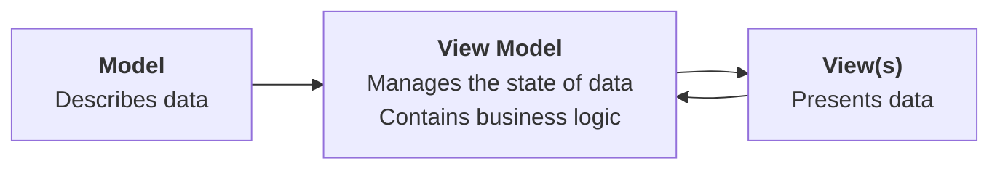

## Introduction

Almost every app that you will author will have a scrollable list of information.

We learned how to create [[Abstraction Using Lists#Create a list (array)|scrollable lists]] very early on in this course.

For example, to create a scrollable list of houses at LCS:

![[LCSHouses.mp4]]

... in the *model* layer of the app, we first needed to define a structure and make it conform to the `Identifiable` protocol:

![[Pasted image 20250313094126.png]]

... and then in the view, we needed to iterate over the array – in this case named `boardingHouses` – using `List` from the SwiftUI framework:

![[Pasted image 20250313094401.png]]

## Common questions

Creating apps with scrollable lists was relatively straightforward to learn at the time, but a couple of common questions came up:

1. What even is the `Identifiable` protocol?
2. What is the value of conforming to the `Identifiable` protocol?
3. Why do instances of a structure, held in an array and shown within a scrollable `List`, need to conform to the `Identifiable` protocol?

Earlier in this course, you were given a clear answer to the first question, but, we skimmed over clear answers for the second and third questions. 

The purpose of this lesson is to now provide a clear answer to the second and third questions above. 

### Identifiable protocol

To recap, the `Idenfiable` protocol has a single rule – a structure that conforms to the protocol must have a stored property named `id` – further – the value held in that property for an instance of the structure must be different from the value held in that property for all other instances of that structure.

For example, consider the following data structure:

```swift
struct Student: Identifiable {
	let id: Int
	let name: String
}
```

This structure conforms to the `Identifiable` protocol because it has a property named `id`.

### Value of conformance

The value of conforming to the `Identifiable` protocol is that it allows us to tell two instances of a structure apart when they would otherwise be indistinguishable.

For example, imagine a class of students being described by creating an array that holds instances of the `Student` data type defined above:

```swift
let students = [

	Student(id: 1, "Alice"),
	Student(id: 2, "Bob"),
	Student(id: 3, "Charlie"),
	Student(id: 4, "Daniela"),
	Student(id: 5, "Bob"),
	
]
```

There are two students named "Bob" in the class, but we can tell them apart because one "Bob" has an assigned `id` of $2$ while the other "Bob" has an assigned `id` of $5$.

Note that while we *could* author code that looks like this:

```swift
let students = [

	Student(id: 2, "Alice"),
	Student(id: 2, "Bob"),
	Student(id: 2, "Charlie"),
	Student(id: 2, "Daniela"),
	Student(id: 2, "Bob"),
	
]
```

... it would be incorrect because we are breaking the promise made when the `Student` structure was declared as conforming to the `Identifiable` protocol – that every instance of the structure would be assigned a unique value for the contents of the `id` property. Since all instances of the `Student` structure have the same value for their `id` property – $2$ – we have not "followed the rules" of the `Identifiable` protocol. It is hard, or impossible, to tell some entries apart.

### Why it matters

As discussed earlier, scrollable lists of information exist in nearly every application written for iOS.

Let's imagine that an app developer is authoring an app to keep track of students in a class.

One feature of that application is that we'd need to be able to remove students from the class – since students sometimes move out of a course, or leave a school.

Now, watch the following video – do you see a problem?

<div style="padding:56.25% 0 0 0;position:relative;"><iframe src="https://player.vimeo.com/video/1066153251?h=6d901935a3&amp;badge=0&amp;autopause=0&amp;player_id=0&amp;app_id=58479" frameborder="0" allow="autoplay; fullscreen; picture-in-picture; clipboard-write; encrypted-media" style="position:absolute;top:0;left:0;width:100%;height:100%;" title="Deleting Entries in a Class"></iframe></div><script src="https://player.vimeo.com/api/player.js"></script>

Granted, this is a made-up, or contrived example, but... it illustrates the problem.

The app developer made some poor choices when programming this application that led to items within an array being indistinguishable from one another. As a result, when deleting items from a scrollable list, the app behaves incorrectly.

Let's examine *how* the app developer programmed the application, and then what they might do instead to avoid the problem shown above.

First, the app developer wrote the following code:

![[Pasted image 20250315105600.png]]

The code is very simple so far – an array named `students` is created on line 13, and it holds five instances of the basic `String` data type.

On line 19, the app developer wrote some placeholder code to simply display *how many* elements there are in the array – we can see there are five elements.

Next, the app developer changed the code to attempt to display a scrollable list. They made the following change:

![[Pasted image 20250315105921.png]]

From lines 18 to 20, they use the `List` structure provided with the SwiftUI framework, and they hope to *iterate* (loop) over the elements of the array to display the five students in the class.

However, shortly after adding that code, they see the following error appear:

![[Pasted image 20250315110037.png]]

The full text of that error message is:

![[Pasted image 20250315110057.png]]

This error occurs because the `List` structure requires that every element within an array that it will iterate over be uniquely identifiable. That is to say – it must be possible to tell one element from another element.

Let's say that the app developer didn't really understand the error message, so they copied the text of the error message into a large language model chatbot application (like ChatGPT) and asked it to help them fix the code.

That may seem like a reasonable course of action, but...

<figure>

<figcaption>
<small>
<strong>Image source:</strong> <a href="https://screenrant.com/here-be-dragons-game-review/">Here Be Dragons Review: A Sinking Sense of Humor</a></small>
</figcaption>
</figure>

... using code from a chatbot without really understanding how it works can lead to more problems.

Let's say that the large language model suggested adding the following code:

![[Pasted image 20250315111047.png]]

This resolves the error, as you can see.

What that code change does – as highlighted on line 18 above – is to tell the Swift compiler to *use the contents of each element of the array itself* to tell one element apart from another.

In other words, the app developer is promising that each element in the array will be different from the next.

Of course, we know this is not the case:

![[Pasted image 20250315111259.png]]

There are two elements in the array with identical information:

|Index|Element|
|-|-|
|0|Alice|
|1|==Bob==|
|2|Charlie|
|3|Daniela|
|4|==Bob==|

To be really specific – the elements at indices 1 and 4 in the array are the same.

However, the app developer was satisfied because they no longer had error messages in their app, so, they committed and pushed their changes to their remote repository.

Next, the app developer wanted to add the ability to delete a student from the class.

They added the following code that does the job of deleting an element from the array:

![[Pasted image 20250315112303.png]]

The app developer then added this code, from lines 20 to 27, to make it possible to actually swipe to delete an item in the scrollable list, from the user interface of the app:

![[Pasted image 20250315121618.png]]

 Note that on line 23, this new code *invokes*, or calls, the `delete` function they just added, passing in the name of the `currentStudent`:

![[Pasted image 20250315122618.png]]

Now, please watch this 5-minute video, narrated by Mr. Gordon, to understand how the `delete` function works:

<div style="padding:56.25% 0 0 0;position:relative;"><iframe src="https://player.vimeo.com/video/1066165388?h=f118d61277&amp;badge=0&amp;autopause=0&amp;player_id=0&amp;app_id=58479" frameborder="0" allow="autoplay; fullscreen; picture-in-picture; clipboard-write; encrypted-media" style="position:absolute;top:0;left:0;width:100%;height:100%;" title="How Items are Deleted From an Array"></iframe></div><script src="https://player.vimeo.com/api/player.js"></script>

Recall that, earlier, we saw the problem with this developer's app:

<div style="padding:56.25% 0 0 0;position:relative;"><iframe src="https://player.vimeo.com/video/1066153251?h=6d901935a3&amp;badge=0&amp;autopause=0&amp;player_id=0&amp;app_id=58479" frameborder="0" allow="autoplay; fullscreen; picture-in-picture; clipboard-write; encrypted-media" style="position:absolute;top:0;left:0;width:100%;height:100%;" title="Deleting Entries in a Class"></iframe></div><script src="https://player.vimeo.com/api/player.js"></script>

The wrong student named "Bob" is being deleted from the class – the user swiped on the second Bob, but the first Bob was deleted.

Why does that happen?

Please watch this 3-minute video to understand why:

<div style="padding:56.25% 0 0 0;position:relative;"><iframe src="https://player.vimeo.com/video/1066166634?h=05febf89e6&amp;badge=0&amp;autopause=0&amp;player_id=0&amp;app_id=58479" frameborder="0" allow="autoplay; fullscreen; picture-in-picture; clipboard-write; encrypted-media" style="position:absolute;top:0;left:0;width:100%;height:100%;" title="The Problem with Deleting Bob"></iframe></div><script src="https://player.vimeo.com/api/player.js"></script>

### Resolving the problem

How could this app developer have better solved their problem?

That is, rather than using the code provided by the large language model, what should they have done instead?

Read on to find out.

> [!NOTE]
> 
> To keep the rest of this lesson as concise as possible all code is being authored inside of a single file.
> 
> When you author an app, using the conventions we have established in this course – separate folders and files for views, view models, and models – is strongly recommended to keep your projects organized and easy to understand.

Here is the developer's current code:

![[Pasted image 20250315130102.png]]

Everything is kept inside the view layer.

It would be better for the developer to [[Separation of Concerns|separate concerns]].

They can begin by defining a model for their application, like this:

![[Pasted image 20250315130356.png]]

Note that the developer has:

1. Made the `Student` structure promise to conform to the `Identifiable` protocol, on line 11.
2. Followed through to actually conform to the `Identifiable` protocol, by adding a stored property named `id` to the `Student` structure, on line 14.

Next, the app developer needs to update their view.

Rather than having the `students` array be a list of instances of the basic `String` data type:

![[Pasted image 20250315131629.png]]

...the `students` array should contain instances of newly defined `Student` structure instead:

![[Pasted image 20250315130949.png]]

On lines 25 to 29 above, note how a different integer has been associated with each student in the class. This ensures that each student in the array is uniquely identifiable.

After that change, the developer needs to update the code for the scrollable list.

As shown on line 36 below, they can first remove the `id: \.self` code that was suggested by the large language model chatbot. This can be down without creating any new compiler errors because the developer just made the `Student` data type conform to the `Identifiable` protocol:

![[Pasted image 20250315131150.png]]

Then, they can make the `Text` view on line 37 use the `name` property of the `Student` structure:

![[Pasted image 20250315131236.png]]

Now, they will need to update their function to delete a student, on line 52:

![[Pasted image 20250315131437.png]]

They can make the function accept an instance of the `Student` data type, instead of a simple `String`:

![[Pasted image 20250315131501.png]]

Next, they need to update the code that compares one student to another.

**It is important that this code use information for a student that allows one student to be differentiated from another.**

The developer *could* update the code as follows:

![[Pasted image 20250315131937.png]]

However, look at what happens when we try to delete a student:

<div style="padding:56.25% 0 0 0;position:relative;"><iframe src="https://player.vimeo.com/video/1066177537?h=45a4559f52&amp;badge=0&amp;autopause=0&amp;player_id=0&amp;app_id=58479" frameborder="0" allow="autoplay; fullscreen; picture-in-picture; clipboard-write; encrypted-media" style="position:absolute;top:0;left:0;width:100%;height:100%;" title="Deleting the Wrong Student"></iframe></div><script src="https://player.vimeo.com/api/player.js"></script>

The wrong "Bob" is still being deleted!

This occurs because although the app developer made their `Student` structure conform to the `Identifiable` protocol:

![[Pasted image 20250315132813.png]]

... and made sure that each instance of the `Student` structure had a different value for the `id` property:

![[Pasted image 20250315132853.png]]

... in the `delete` function, they are still comparing one student to another using the student's *name* – which is a problem, because there are two students in the class named "Bob":

![[Pasted image 20250315132722.png]]

What the developer should be doing instead is using the `id` property to determine which student is which:

![[Pasted image 20250315133108.png]]

Now, when the Bob at the end of the list is swiped and marked for deletion by the user, it is that Bob which is actually deleted:

<div style="padding:56.25% 0 0 0;position:relative;"><iframe src="https://player.vimeo.com/video/1066182764?h=61ca7913ea&amp;badge=0&amp;autopause=0&amp;player_id=0&amp;app_id=58479" frameborder="0" allow="autoplay; fullscreen; picture-in-picture; clipboard-write; encrypted-media" style="position:absolute;top:0;left:0;width:100%;height:100%;" title="Deleting the Correct Student"></iframe></div><script src="https://player.vimeo.com/api/player.js"></script>

The code as-is solves the problem, so the app developer committed and pushed their work.

## Refining the solution

The purpose of this lesson was to answer the [[Identifiable Instances of a Structure#Common questions|three common questions]] about the `Identifiable` protocol that were posed earlier.

That has been accomplished, so, you could stop reading here.

However, the code in this example application is not quite as good as it could be just yet.

If you'd like to see the code for this app in it's best possible form – keep reading.

There is a structure that serves as the model layer to *describe* data:

![[Pasted image 20250315140827.png]]

However, the view layer contains code to hold the *current state* of the data in the app:

![[Pasted image 20250315140912.png]]

The view layer also contains code that *changes the current state of data* within the app:

![[Pasted image 20250315140944.png]]

As we learned in the [[Separation of Concerns]] lesson, it is the job of the *view model* to manage and change the current state of data within an app:



So, the developer would, in the best case scenario, move the array that holds the list of students into a view model, along with the function that deletes a student:

![[Pasted image 20250315142000.png]]

The developer could then adjust the view to use the new view model by first removing the `delete` function from the view:

![[Pasted image 20250315142047.png]]

... like this:

![[Pasted image 20250315142111.png]]

Then, they would just need to make the view layer use the new view model, like this:

![[Pasted image 20250315142159.png]]

Finally, they would adjust the code in the scrollable list, so it iterates over the array from the view model:

![[Pasted image 20250315142236.png]]

... and so that it invokes the `delete` function from the view model, as well:

![[Pasted image 20250315142303.png]]

The completed code now looks like this, overall:

```swift
import SwiftUI

// MODEL
struct Student: Identifiable {
    
    // MARK: Stored properties
    let id: Int
    let name: String
    
}

// VIEW MODEL
@Observable
class ClassListViewModel {
    
    // MARK: Stored properties
    var students: [Student]
    
    // MARK: Initializer(s)
    init(students: [Student]) {
        self.students = students
    }
    
    // MARK: Function(s)
    func delete(providedStudent: Student) {
        
        // Iterate over the elements of the array and find the student to delete
        for i in 0...students.count - 1 {
            if students[i].id == providedStudent.id {
                
                // Remove the current student
                students.remove(at: i)
                
                // Exit the loop (don't delete any more students)
                break
            }
        }
        
    }
    
}


// VIEW
struct ClassListView: View {
    
    // MARK: Stored properties
    @State var viewModel = ClassListViewModel(students: [
        
        Student(id: 1, name: "Alice"),
        Student(id: 2, name: "Bob"),
        Student(id: 3, name: "Charlie"),
        Student(id: 4, name: "Daniela"),
        Student(id: 5, name: "Bob"),
        
    ])
    
    // MARK: Computed properties
    var body: some View {
        NavigationStack {
            List(viewModel.students) { currentStudent in
                Text(currentStudent.name)
                    .swipeActions {
                        Button("Delete") {
                            withAnimation {
                                viewModel.delete(providedStudent: currentStudent)
                            }
                        }
                        .tint(.red)
                    }
            }
            .navigationTitle("Class List")
        }
    }
    
}

#Preview {
    ClassListView()
}
```

The app developer could properly organize the project into separate groups and folders like so:

<div style="padding:56.25% 0 0 0;position:relative;"><iframe src="https://player.vimeo.com/video/1066188002?h=73ccb8becc&amp;badge=0&amp;autopause=0&amp;player_id=0&amp;app_id=58479" frameborder="0" allow="autoplay; fullscreen; picture-in-picture; clipboard-write; encrypted-media" style="position:absolute;top:0;left:0;width:100%;height:100%;" title="Organizing the Project"></iframe></div><script src="https://player.vimeo.com/api/player.js"></script>

As you can see, the project is now well organized, and, the correct student is still deleted when the user tries to remove someone from the class! 🎉