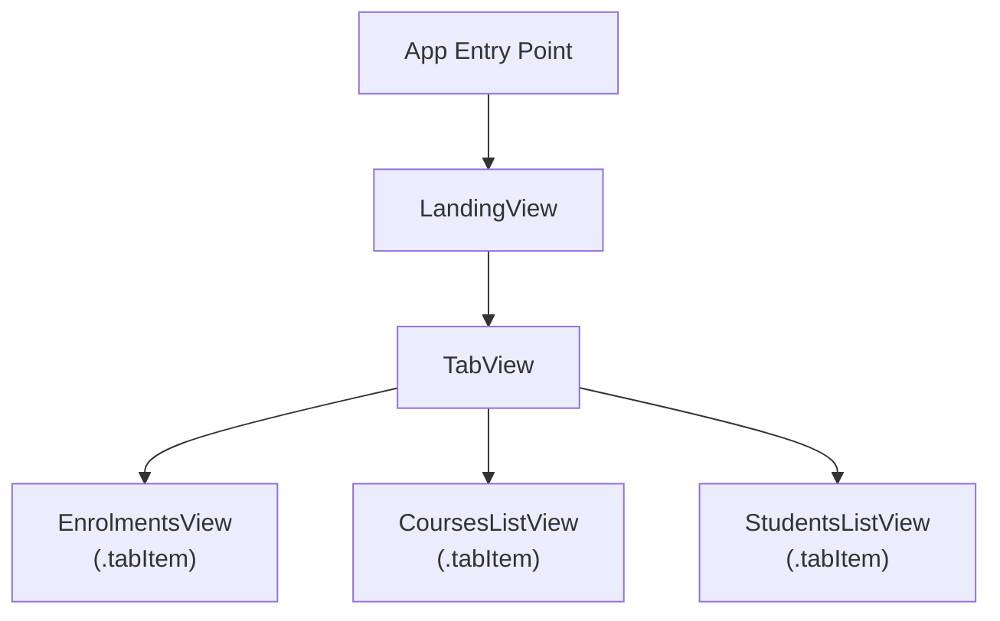
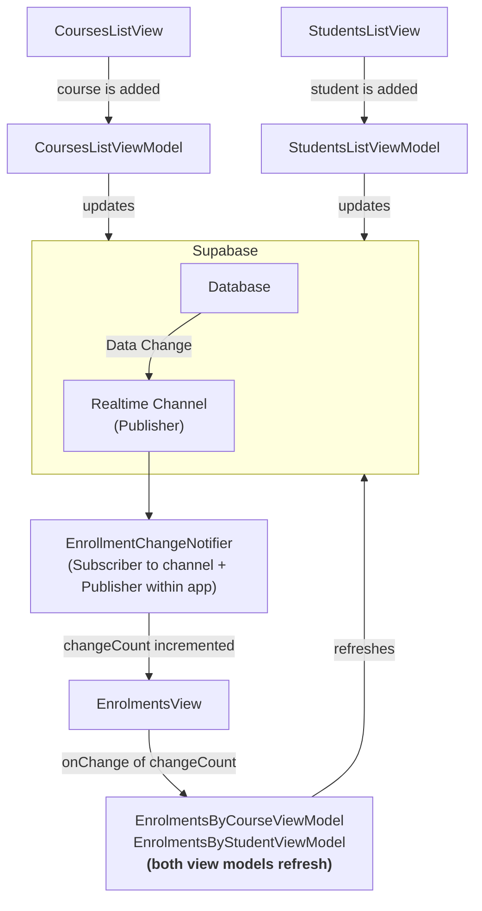

## Introduction

Before reviewing this lesson you are encouraged to have at least read through [[Querying Multiple Tables, Pt. 2]] and have [downloaded the finished form of the Enrolments app](https://github.com/lcs-rgordon/StudentsAndCourses/archive/644a4c2fcaf2f95b91d5ef0e187512d4da4475db.zip) to try it out.

The approach to seeing up-to-date data shared in *this* lesson *may* be necessary for your app – it depends on how users navigate through different views within your app.

If you do try out the app, you may notice an issue – watch this video carefully:

<div style="padding:56.25% 0 0 0;position:relative;"><iframe src="https://player.vimeo.com/video/1083182394?h=8e6b8f01ad&amp;badge=0&amp;autopause=0&amp;player_id=0&amp;app_id=58479" frameborder="0" allow="autoplay; fullscreen; picture-in-picture; clipboard-write; encrypted-media" style="position:absolute;top:0;left:0;width:100%;height:100%;" title="Updates Not Seen in Other Views"></iframe></div><script src="https://player.vimeo.com/api/player.js"></script>

At first, this might seem surprising – after all – didn't we add the new courses first and *then* navigate to the tab that shows enrolment counts by course? Therefore, shouldn't the newly added courses show up?

The answer is *no* because of the way SwiftUI works. It needs to compute (put together) all of the views that might be immediately visited by a user *when the app launches*.

So in the case of this app, the list of views already created when the app first launches are:



Each of those views creates the following view models:

|View|View Model(s)|
|-|-|
|`EnrolmentsView`|&#8226;`EnrolmentsByCourseViewModel`<br/>&#8226;`EnrolmentsByStudentViewModel`|
|`CoursesListView`|`CoursesListViewModel`|
|`StudentsListView`|`StudentsListViewModel`|

So in the video above, the user goes to `CoursesListView` and adds a couple of courses. `CoursesListViewModel` handles sending the new courses to the database. `CoursesListViewModel` (since it knows a new course was just added) asks the database for a refreshed list of courses.

However, `EnrolmentsView` and the two view models it creates were made *before the user added the courses* on `CoursesListView` . Consequently, those two view models are left with out-of-date information. They have no way of knowing that the database has been changed.

How can we deal with this?

## A dangerous path

Apple states that: "SwiftUI offers a declarative \[and reactive\] approach to user interface design..."

This means that we don't have to handle the messy details of precisely laying out a user interface, nor do we have to manually tell parts of our user interface to update when data changes.

So while we might initially think:

> "OK, well if those view models have out of date information, I'll just tell them – after adding a new course – to refresh themselves!"

That would be a mistake. That is exactly the type of situation that SwiftUI was designed to help programmers avoid. Put another way:

<figure>

<figcaption>
<small>
<strong>Image source:</strong> <a href="https://screenrant.com/here-be-dragons-game-review/">Here Be Dragons Review: A Sinking Sense of Humor</a></small>
</figcaption>
</figure>

Rather than thinking about how we can manually *tell* parts of our app when to update their data, we need our app to *notice* when data has changed, and *react* accordingly. 

Reacting to changes in data – to changes in state – is much easier to deal with in practice. It eliminates an entire category of potential bugs – namely – forgetting to tell parts of an app when it needs to update.

## Publish-subscribe

> [!NOTE]
> 
> Mr. Gordon used ChatGPT to "boil down" the essence of the publisher-subscriber messaging pattern into wording appropriate for use in a high-school level computer science class.
> 
> Some of the text in this section of this lesson is directly quoted from his conversation with the large language model.

Publish-subscribe (or pub/sub) is a messaging pattern where:

- **Publishers** send messages (events, updates) without knowing who will receive them.
- **Subscribers** listen for specific messages and react when they arrive.

Here are the key ideas:

| Role                  | Responsibility                                                  |
| --------------------- | --------------------------------------------------------------- |
| **Publisher**         | Says, “Hey, something happened!”                                |
| **Subscriber**        | Says, “Tell me when this kind of thing happens.”                |
| **Broker (optional)** | Mediates communication (e.g., a notification center, event bus) |

Pub/sub is **one-to-many**:

- One publisher can notify many subscribers.
- The publisher doesn’t need to know who’s listening.

Here is how the pub/sub concept can be applied to resolve the problem with getting up-to-date data in all parts of our app.

The *source of truth* for data within our app is our Supabase database. Supabase offers a feature known as *realtime channels*. Whenever data changes within some (or any) part of our database, Supabase can broadcast this event to interested parties. A Supabase realtime channel is a **publisher**.

We will add an observable class to our app named `EnrollmentChangeNotifier`. It will use the Supabase framework to **subscribe** to a realtime channel, and will therefore be notified whenever the database is updated.

`EnrollmentChangeNotifier` is also a **publisher**, as it contains a single stored property named `changeCount`. Whenever the database is updated, `EnrollmentChangeNotifier` will increment `changeCount` by one. We can describe `EnrollmentChangeNotifier` as a *broker* because it acts as both a subscriber and a publisher.

In turn, within our app, view(s) that would otherwise be unaware of database changes will observe `changeCount` on `EnrollentChangeNotifier`  through the environment. Using a `.onChange(of:)` view modifier, each view **subscribes** to the broker, `EnrollmentChangeNotifier`. When a view sees that `changeCount` has been incremented, it will ask its view model to refresh data (to fetch new information from the database).

This will let us **fan out** a single event (e.g.: a database change) to one or more views within our app.

For the students and courses app we are looking at for this lesson, here is how this will work:



Summarized:

- The **Supabase database** sends a change notification via a **Realtime Channel**.
- This message is received by our app’s **EnrollmentChangeNotifier**, which then acts as a **publisher** inside the app.
- Subscribing views listen for updates to `changeCount`.
- Each subscribed view tells its **view model** to fetch fresh data from Supabase.

The advantage of this approach is that we have just **one** subscription to the realtime channel in our database. This conserves database server resources. 

## Applying the pattern

### Enable realtime updates on database

To start, we need to turn on realtime updates in the database. This makes the database a publisher.

To do this, from the project overview page, select **Table Editor**:

![[Pasted image 20250512091000.png]]

You will see the list of tables in your database:

![[Pasted image 20250512091105.png]]

At this point you need to decide – do you want to have changes to just *some* database tables published for subscribers to receive notifications about – or *all* database tables?

In the context of this example – students and courses in an enrolment scenario – changes to any table will impact what should be shown to users in the app.

So, Mr. Gordon has edited each table in turn:

![[Pasted image 20250512091315.png]]

... and enabled realtime:

![[Pasted image 20250512091446.png]]

> [!IMPORTANT]
> 
> Be sure to enable realtime on all tables you want to receive notifications about changes on.

### Check Supabase version

Before continuing, please double-check that you are using version 2.24.1 of the Supabase framework.

If you don't see that at the bottom of the Project Navigator in Xcode:

![[Pasted image 20250512151042.png|300]]

... then please watch this brief video to learn how to change to the correct version.

<div style="padding:56.25% 0 0 0;position:relative;"><iframe src="https://player.vimeo.com/video/1083649047?h=ae6a57ddd3&amp;badge=0&amp;autopause=0&amp;player_id=0&amp;app_id=58479" frameborder="0" allow="autoplay; fullscreen; picture-in-picture; clipboard-write; encrypted-media" style="position:absolute;top:0;left:0;width:100%;height:100%;" title="Getting the Correct Version of the Supabase Framework"></iframe></div><script src="https://player.vimeo.com/api/player.js"></script>

### Add logging

Before we add code to implement the pub/sub messaging pattern in our app, it will be helpful to take a detour and talk about logging.

> [!TIP]
> 
> If you *really* want to dive in to what logging within an app is, watch this 13-minute WWDC video published by Apple:
> 
> [Debug with structured logging](https://developer.apple.com/videos/play/wwdc2023/10226)
> 
> Mr. Gordon will give you the short version below.

As our apps grow in complexity, they become harder to debug. We need to know what is happening and when. That is where *log messages* or *logging* can help.

The gist of the idea is to sprinkle messages to ourselves (as developers) throughout our app. End users will never see these messages, but they can help us as developers to debug logical errors during the development process, and potentially, to understand what went wrong if we happen to ship an app with a bug to our end-users.

We can organize our log messages into different categories. Let's start doing this now, by copying this code:

```swift
import OSLog

extension Logger {

    // Using your bundle identifier is a great way to ensure a unique identifier.
    private static var subsystem = Bundle.main.bundleIdentifier!

    // Logs the view cycles like a view that appeared
    static let viewCycle = Logger(subsystem: subsystem, category: "viewcycle")

    // All logs related to tracking and analytics
    static let statistics = Logger(subsystem: subsystem, category: "statistics")

    // All logs related to database operations
    static let database = Logger(subsystem: subsystem, category: "database")

    // All logs related to user authentication
    static let authentication = Logger(subsystem: subsystem, category: "authentication")

}
```

... to a file named `Logger.swift` in a group named `Logging`, like this:

![[Pasted image 20250512153506.png]]

What this allows us to do is record log messages but keep track of them within different categories. More on that in a moment.

For now, before continuing, Mr. Gordon committed his changes with this message:

```
Switched to Supabase 2.24.1 and added support for structured (categorized) log messages.
```

### Subscribe to a channel

Earlier we [[#Enable realtime updates on database|configured the database to broadcast (publish) changes to database tables]].

Now that the database is broadcasting changes to database tables, we need to add code that that subscribes to and receives those notifications.

You are welcome to copy the following code and adapt it to your own project (all you would likely be changing is the name of the *class* and the *channel*):

```swift
import OSLog
import Supabase
import SwiftUI

@Observable @MainActor
class EnrollmentChangeNotifier: Observable {

    // MARK: Stored properties
    
    // Subscribing views will monitor this property
    // and ask their view models to refresh data when
    // it changes
    var changeCount = 0
        
    // Stores a channel that we will subscribe to
    // and receive realtime updates from
    private var channel: RealtimeChannelV2?
    
    // MARK: Initializer(s)
    init() {
        
        Logger.database.info("EnrollmentChangeNotifier: Initializer has completed.")
        
	}
    
    // MARK: Function(s)
    func subscribe() {
        
        Logger.database.info("EnrollmentChangeNotifier: About to create channel to receive realtime updates.")

        // Create a channel to that we will subscribe to
        // and receive realtime updates from
        self.channel = supabase.channel("enrollment-updates")
        if let channel = self.channel {

            Logger.database.info("EnrollmentChangeNotifier: Successfully created channel to receive realtime updates.")

            // We are going to observe all changes
            // (insertions, updates, deletions)
            // on any table in the database
            let changeStream = channel.postgresChange(
                AnyAction.self,
                schema: "public"
            )
            
            Logger.database.info("EnrollmentChangeNotifier: Successfully created stream to identify scope of database changes we will subscribe to (all types of changes, on all database tables).")
		
            Task {
                
                // Subscribe to notifications on the channel
                await channel.subscribe()

                Logger.database.info("EnrollmentChangeNotifier: Now subscribed to channel to receive realtime updates.")

                // When a change occurs, run this code block
                for await change in changeStream {
                    
                    Logger.database.info("EnrollmentChangeNotifier: Database changed; incrementing change counter.")

                    // Update the count of changes to tell subscribing views
                    // to ask their view models to update
                    changeCount += 1
                    
                }
                
            }

        } else {
            
            Logger.database.info("EnrollmentChangeNotifier: Unable to create channel to receive realtime updates.")

        }
        
    }
    
    func unsubscribe() {
        Logger.database.info("EnrollmentChangeNotifier: About to unsubscribe from realtime updates channel.")
        Task {
            if let channel = channel {
                await supabase.removeChannel(channel)
                Logger.database.info("EnrollmentChangeNotifier: Successfully unsubscribed from realtime updates channel.")
            } else {
                Logger.database.info("EnrollmentChangeNotifier: Could not unsubscribe from realtime updates channel.")
            }

        }
    }
        
}
```

Mr. Gordon chose to add this file to the **Helpers** group in his project:

![[Pasted image 20250512153926.png]]

It's good to understand code that we add to our projects, so, let's examine this more closely:

![[Pasted image 20250512154214.png]]

In order:

> [!DISCUSSION]
> 
> 1. The `EnrollmentChangeNotifier` class must conform to the `Observable` protocol, so that our views can watch the class for changes and respond accordingly.
> 2. `@MainActor` should be added to all classes that will drive changes to the user interface. This ensures that the code in the class will run on the main thread of our application, rather than a background thread. By running on the main thread, we ensure that the user interface updates in a timely manner. Read this for [more background on what threads are](https://www.hackingwithswift.com/quick-start/concurrency/understanding-threads-and-queues), if desired.
> 3. Here we create a channel to subscribe to. Select a name that makes sense for the context of your app; here, Mr. Gordon chooses `enrollment-updates`.
> 4. With this code we configure what kind of updates we want to be notified about, and from what tables. This code asks for all types of updates (*insertions* of a new row to a table, *updates* to an existing row, and *deletions* of a row). This code also asks for notifications on every database table, not just a single table.
> 5. Create an asynchronous task block (line 55) that will run and wait for update notifications from the database.
> 6. Subscribe to the channel we created earlier (line 58).
> 7. The code from lines 63 to 71 can be thought of as a loop that will iterate – run its code block – only when a change notification is received from the database.
> 8. There are times when we want to *unsubscribe* from receiving database update notifications – more on that in a moment.

Now that we have these changes made, we need to create an instance of the `EnrollmentChangeNotifier` class at the app entry point, and insert it into the environment.

Here are the changes that make this happen:

![[Pasted image 20250512154644.png]]

That code needs a bit of explanation too, so let's go over it:

> [!DISCUSSION]
> 
> 1. Here is where the instance of `EnrollmentChangeNotifier` is created.
> 2. We insert the instance of `EnrollmentChangeNotifier` into the environment so that views can (later) observe it for changes.
> 3. We create a stored property that tracks changes to *scenes* in our app. This is used to identify when our app is closed or backgrounded on a device.
> 4. This code (lines 27 to 40) handles subscribing to database change notifications (when the app is active) or unsubscribing (when the app goes to the background).

Here is what the code looks like when the app runs:

<div style="padding:56.25% 0 0 0;position:relative;"><iframe src="https://player.vimeo.com/video/1083666575?h=145e51692a&amp;badge=0&amp;autopause=0&amp;player_id=0&amp;app_id=58479" frameborder="0" allow="autoplay; fullscreen; picture-in-picture; clipboard-write; encrypted-media" style="position:absolute;top:0;left:0;width:100%;height:100%;" title="Demonstration of the Change Notifier Class in Action"></iframe></div><script src="https://player.vimeo.com/api/player.js"></script>

Our logging code creates the messages that show in the debug console. We can see that the `EnrollmentChangeNotifier` class is subscribing to updates when the app is opened, and unsubscribing when the app is backgrounded.

These are important changes, so Mr. Gordon committed his code at this point with the following message:

>  `Added change notifier class to subscribe and unsubscribe to database changes as needed.`

### Use @MainActor on all view models

Using the pub/sub messaging pattern means that:

- our views will subscribe to the change notifier class
- when a view observes a change to `changeCount`, it will ask its view model to refresh its data from the database
- data in the view model will change
- we want to the updated data in our user interface

**To be sure that we see these changes reliably, we must run view models on the main thread of our application.**

As mentioned earlier, that means adding `@MainActor` to the declaration of each view model class, like this...

In `CoursesListViewModel`:

![[Pasted image 20250512162403.png]]

In `StudentsListViewModel`:

![[Pasted image 20250512162444.png]]

In `EnrolmentsByCourseViewModel`:

![[Pasted image 20250512162555.png]]

In `EnrolmentsByStudentViewModel`:

![[Pasted image 20250512162617.png]]

In `AddEnrolmentFromEnrolmentsbyCourseViewModel`:

![[Pasted image 20250512162654.png]]

In `AddEnrolmentFromEnrolmentsbyStudentViewModel`

![[Pasted image 20250512162717.png]]

Mr. Gordon then committed his changes with this message:

> `Before having views observe changes to the change notifier class, made sure each view model is running on the main thread of our application.`

### Subscribe view to change notifier

Recall that there are *three* views created when the app launches:


Visually, within the app:

![[Pasted image 20250512161645.png|350]]

`EnrolmentsView` has view models whose data becomes out of date when a new course is added (on `CoursesListView`) or when a new student is added (on `StudentsListView`).

Since the view models made within `EnrolmentsView` are created *when the app launches* we need to make that view watch for changes that are published by `EnrollmentChangeNotifier`. Then, it will know when to ask its view models to refresh their data.

#### Update view models

We must begin by modifying the view models to add a `refresh` method to each one.

`EnrolmentsByCourseViewModel` looks like this right now:

![[Pasted image 20250512164858.png]]

We can adjust `EnrolmentsByCourseViewModel` like so:

![[Pasted image 20250512165318.png]]

All that we have done is:

1. Moved code out of the initializer and into the `refresh` method.
2. Added some additional logging messages to aid with debugging logical errors in the future.

Next, we make similar changes to `EnrolmentsByStudentViewModel`. It looks like this now:

![[Pasted image 20250512165436.png]]

We make these adjustments:

![[Pasted image 20250512165611.png]]

#### Update view

Next, we adjust `EnrolmentsView` in three ways.

First, we retrieve a reference to the change notifier class from the environment:

![[Pasted image 20250512164147.png]]

Next, we create its view models as stored properties – these are in turn passed as arguments to the views that use them:

![[Pasted image 20250512164311.png]]

Finally, we make `EnrolmentsView` observe the change notifier and update its view models when a database change occurs:

![[Pasted image 20250512165734.png]]

With these changes, we now have `EnrolmentsView` watching the change notifier class, and refreshing its view models when a database change occurs. Let's see what this looks like:

<div style="padding:56.25% 0 0 0;position:relative;"><iframe src="https://player.vimeo.com/video/1083683009?h=4314ed0bd9&amp;badge=0&amp;autopause=0&amp;player_id=0&amp;app_id=58479" frameborder="0" allow="autoplay; fullscreen; picture-in-picture; clipboard-write; encrypted-media" style="position:absolute;top:0;left:0;width:100%;height:100%;" title="Seeing Changes Propagate Throughout the App"></iframe></div><script src="https://player.vimeo.com/api/player.js"></script>

That is it!
Any other views (within a larger app) that need to update their data when the database changes can use the same approach to subscribe to `EnrollmentChangeNotifier` and then update their view model, as needed.