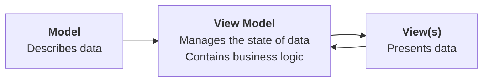

---
tags:
created: 2025-02-13T07:00:00.000-0400
createdForSectionTwo: 2025-01-13T07:00:00.000-0400
draft: false
draftSectionTwo: true
---

## Introduction

All software applications, or "apps" for short:

1. accept input
2. process that input somehow according to a set of rules or "business logic"
3. show output

As apps grow in size and complexity, software developers use *design patterns* to keep a project organized and easy to understand.

Employing a design pattern in this way is known as *separating concerns*. Simply – we try to avoid putting "all our eggs in one basket" or placing all of our code for an app within one file.

## View

A *view* is anything the user sees within our apps or interacts with.

For example, consider this simple view – it is a structure designed to show a single item within a list – displaying a title and a subtitle:

![[Screenshot 2023-11-14 at 11.54.10 AM.png]]

You have already written many views while learning about layout and designing interfaces with SwiftUI. 🤩

## Model

The *model* within an app stores the data and logic related to that data.

What does that mean? 

Let's look at an example – here is a model for a circle:

```swift
struct Circle {
    
    // MARK: Stored properties
    var radius: Double
    
    // MARK: Computed properties
    var diameter: Double {
        return 2 * radius
    }
    
    var perimeter: Double {
        return 2 * Double.pi * radius
    }
    
    var area: Double{
        return Double.pi * radius * radius
    }
}
```

When we write a structure to serve as part of the model for our app, we consider:

1. What data it needs to store – these become *stored properties*.
2. What data it should offer – what useful information it could provide – these become *computed properties* .

You have already created many models when authoring Swift structures to describe shapes, hockey cards, book listings... 🚀

## View Model

The *view model* is a concept that is new to you.

We will explore the role of a view model in this lesson.

The view model (as implied by its name) sits between the model code and the view code in an app.

A view model's job is to store the *current state* of data within an app, and to encapsulate (contain) any business logic (processing rules) required to make the app perform its stated function.

## The MVVM design pattern

MVVM is a *software design pattern* and the acronym stands for *Model-View-ViewModel*.

Here is a visual summary of this design pattern:



## Create the project

<pre>add instructions to create project</pre>

## Accept free-form input

Let's now apply this concept and extend an app that you wrote earlier in the [[Revisiting Interactive Apps]] exercise.

In that exercise, you wrote the following app:

![[RocketSim_Recording_iPhone_15_Pro_2023-11-14_13.31.53.gif|300]]

However, the app's interface leaves a little to be desired. If a user wanted to find the square of even a slightly larger number (say, [42](https://www.goodreads.com/book/show/11.The_Hitchhiker_s_Guide_to_the_Galaxy)) then they must repeatedly tap the stepper control.

This is very tedious.

As well, all of the logic for that app is kept within the view:

1. Input is collected through the `Stepper` control
2. Input is processed (via a stored property)
3. The result is shown (via a `Text` control)

What if we could adjust the app so that it works as follows instead?

<pre>add animation</pre>

In this version of the app, the user can type whatever they want into the text box. 

An answer, or an appropriate error message, is shown to the user.

To write this app, we will separate concerns using the MVVM design pattern. Let's get started.

## Start with the data

Apps are simply an interface to data. App developers, like you and I, help end users by writing apps that make it easier to manipulate data. This can be a lot of fun, and very lucrative.

For a brief digression, have a look at the [Future of Jobs Report 2025](https://reports.weforum.org/docs/WEF_Future_of_Jobs_Report_2025.pdf), issued by the [World Economic Forum](https://www.weforum.org/about/world-economic-forum/) – here's a key page:

![[Screenshot 2025-02-11 at 5.27.02 PM.png]]

Conservatively, six of the fifteen job categories listed are occupations for which a degree in computer science or software engineering would be essential. For some of the other job categories listed, understanding those subject areas would certainly be helpful.

Anyway, where were we? That's right – *data*.

Begin by authoring the model. To do this, ask yourself two questions:

1. What data do we need to store? These become *stored properties*.
2. What data can the model provide? These become *computed properties* .

<pre>explain development of Power structure, test in playground</pre>

## Express the interface

Next we can build out the interface.

In this case, we can re-use the view that we built out in the [[Revisiting Interactive Apps]] lesson.

Copy-paste the code below into `PowerView` within your project:


