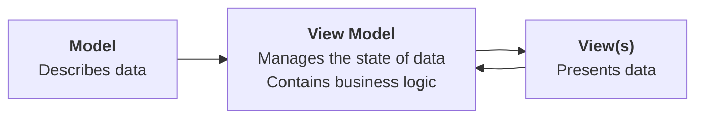

---
tags:
created: 2025-02-20T07:00:00.000-0400
createdForSectionTwo: 2025-03-26T07:00:00.000-0400
draft: false
draftSectionTwo: false
---

## Introduction

All software applications, or "apps" for short:

1. accept input
2. process that input somehow according to a set of rules or "business logic"
3. show output

As apps grow in size and complexity, software developers use *design patterns* to keep a project organized and easy to understand.

Employing a design pattern in this way is known as *separating concerns*. Simply put – we try to avoid placing "all our eggs in one basket" or writing all of our code for an app within one file.

## The MVVM design pattern

MVVM is a *software design pattern* and the acronym stands for *Model-View-ViewModel*.

Here is a visual summary of this design pattern:



## View

A *view* is anything the user sees within our apps or interacts with.

For example, consider this simple view – it is a structure designed to show a single item within a list – displaying a title and a subtitle:

![[Screenshot 2023-11-14 at 11.54.10 AM.png]]

You have already written many views while learning about layout and designing interfaces with SwiftUI. 🤩

## Model

The *model* within an app stores the data and logic that is directly related to that data.

What does that mean? 

Let's look at an example – here is a model for a circle:

```swift
struct Circle {
    
    // MARK: Stored properties
    var radius: Double
    
    // MARK: Computed properties
    var diameter: Double {
        return 2 * radius
    }
    
    var perimeter: Double {
        return 2 * Double.pi * radius
    }
    
    var area: Double {
        return Double.pi * radius * radius
    }
}
```

When we write a structure to serve as part of the model for our app, we consider:

1. What data it needs to store – these become *stored properties*.
2. What data it should offer – what useful information it could provide – these become *computed properties* .

You have already created many models when authoring Swift structures to describe shapes, hockey cards, book listings... 🚀

## View Model

The *view model* is a concept that is new to you.

We will explore the role of a view model in this lesson.

The view model (as implied by its name) sits between the model code and the view code in an app.

A view model's job is to store the *current state* of data within an app, and to *encapsulate* (contain) any *business logic* (processing rules) required to make the app perform its stated function. A common form of business logic in view models is code that *validates* user input (makes sure that the input is in the expected form).

## Accept free-form input

Let's now apply this concept and re-write an app that you made earlier in the [[Revisiting Interactive Apps]] exercise.

In that exercise, you wrote the following app:

![[RocketSim_Recording_iPhone_15_Pro_2023-11-14_13.31.53.gif|300]]

However, the app's interface leaves a little to be desired. If a user wanted to find the square of even a slightly larger number (say, [42](https://www.goodreads.com/book/show/11.The_Hitchhiker_s_Guide_to_the_Galaxy)) then they must repeatedly tap the stepper control.

This is very tedious.

As well, all of the logic for that app is kept within the view:

1. Input is collected through the `Stepper` control
2. Input is processed (via a stored property)
3. The result is shown (via a `Text` control)

What if we could adjust the app so that it works as follows instead?

![[RocketSim_Recording_iPhone_16_Pro_6.3_2025-02-19_12.51.03 - 01.gif|300]]

In this version of the app, the user can type whatever they want into the text fields. 

An answer, or an appropriate error message, is shown to the user.

To write this app, we will separate concerns using the MVVM design pattern.

To summarize, here are the specific roles each layer will play in the re-designed app:

|Layer|Role|
|-|-|
|Model|Hold the base and exponent in numeric form; provide the result of evaluating the power.|
|View Model|Hold the text provided by the user for the base and exponent; provide an instance of the model – the power – where possible, otherwise, provide an appropriate error message.|
|View|Collect input from the user and display whatever output is provided by the view model.|

We will first work within a playground, so that we can focus on learning how the MVVM design pattern works at the *model* and *view model* layers.

Then, we will move our code into a full-fledged project, and add the *view* layer.

## Create the playground

Please create a [[Xcode Playgrounds|new macOS playground]] named **PowersPlayground**, like this:

![[Pasted image 20250219153404.png]]

### Start with the data

Apps are simply an interface to data. App developers, like you and I, help end users by writing apps that make it easier to view or manipulate data that they care about. Writing apps to do this can be a lot of fun, and very lucrative.

> [!NOTE]
> 
> For a brief digression, have a look at the [Future of Jobs Report 2025](https://reports.weforum.org/docs/WEF_Future_of_Jobs_Report_2025.pdf), issued by the [World Economic Forum](https://www.weforum.org/about/world-economic-forum/) – here's a key page:
> 
> ![[Screenshot 2025-02-11 at 5.27.02 PM.png]]
> 
> Conservatively, six of the fifteen job categories listed are occupations for which a degree in computer science or software engineering would be essential. For some of the other job categories listed, understanding those subject areas would certainly be helpful.

Anyway, where were we? That's right – *data*.

Begin by authoring the model.

### Create the model

To create a model, once again, ask yourself two questions:

1. What data do we need to store? These become *stored properties*.
2. What data can the model provide? These become *computed properties*.

#### Stored properties

When evaluating a power, there are two separate pieces of information that must be provided by the user:

1. the base value (what will be multiplied)
2. the exponent (how many times the base will be multiplied by itself)

For example, if the base is $3$ and the exponent is $2$ then the power would be evaluated like this:

$$
\begin{align}
&=3^2  \\
&=3\times3 \\
&=9\\
\end{align}
$$

The base is not limited to being an integer. Say that the base of a power was $0.5$ and the exponent was $3$. Then the power would be evaluated as:

$$
\begin{align}
&=\left(0.5\right)^3 \\
&=\left(0.5\right)\times\left(0.5\right)\times\left(0.5\right) \\
&=\left(0.25\right)\times\left(0.5\right) \\
&=0.125 \\
\end{align}
$$

Considering all of this, we can begin authoring our app's data model, within the playground, at first.

Copy the following code into your clipboard:

```swift
import Foundation

// MODEL
struct Power {
    
    // MARK: Stored properties
    
    // The base of the power can hold any numeric value
    var base: Double
    
    // The exponent of a power must be an integer
    var exponent: Int    
}

```

... then paste it into the playground, like this:

![[Pasted image 20250219153726.png]]

#### Computed properties

We know that a power is nothing more than a convenient way, symbolically, to represent repeated multiplication.

Consider one more example of a power with a base of $10$ and an exponent of $4$:

$$
\begin{align}
&=\left(10\right)^4 \\
&=\left(10\right)\left(10\right)\left(10\right)\left(10\right) \\
&=10000 \\
\end{align}
$$

In our structure that models a power, then, the useful information our model can provide is *the result of evaluating the power*. That becomes our computed property.

> [!NOTE]
> 
> The `Foundation` framework *does* provide us with a built-in way to evaluate powers, but we will learn more by implementing our own logic to do this.

Add the following code to your `Power` structure, after the two stored properties, but *before* the closing curly bracket of the structure:

```swift
// MARK: Computed properties

// A power is simply a shorter way of expressing
// repeated multiplication.
//
// e.g.: 3^2 
//       = 3 * 3
//       = 9
//
// The base, 3, mutiplied by itself twice, resulting in 9
// 
// This could also be expressed as:
//
// e.g.: 3^2 
//       = 1 * 3 * 3
//       = 9
// 
// We will implement code that mimics this second example.
var result: Double {
	
	// Start by making the solution equal to 1
	var solution = 1.0
	
	// Repeatedly multiply the base by itself
	// as many more times as needed 
	for _ in 1...exponent {
	    solution *= base
	}
	
	// Return the solution
	return solution
	
}
```

When complete, your `Power` structure should look like this:

![[Pasted image 20250219153934.png]]

...and this, within your playground:

![[Pasted image 20250219153959.png]]

#### Test the model

We have authored a *model* layer by creating the `Power` structure.

We can test this code by creating a few instances of the `Power` structure and verifying that the results are what we expect to see:

<div style="padding:56.25% 0 0 0;position:relative;">
	<iframe src="https://player.vimeo.com/video/1058365448?h=3c493bf47a&amp;badge=0&amp;autopause=0&amp;player_id=0&amp;app_id=58479&portrait=0&byline=0&title=0" frameborder="0" allow="autoplay; fullscreen; picture-in-picture; clipboard-write" style="position:absolute;top:0;left:0;width:100%;height:100%;" title="Opening the Teamspace">
	</iframe>
	</div>
<script src="https://player.vimeo.com/api/player.js"></script>

To better understand how the computed property calculates the result of the power, you may wish to review this video where Mr. Gordon steps through the code using the debugging interface in Xcode (more on how to use this interface yourself in a future class):

<div style="padding:56.25% 0 0 0;position:relative;">
	<iframe src="https://player.vimeo.com/video/1058368634?h=06efcf8092&amp;badge=0&amp;autopause=0&amp;player_id=0&amp;app_id=58479&portrait=0&byline=0&title=0" frameborder="0" allow="autoplay; fullscreen; picture-in-picture; clipboard-write" style="position:absolute;top:0;left:0;width:100%;height:100%;" title="Opening the Teamspace">
	</iframe>
	</div>
<script src="https://player.vimeo.com/api/player.js"></script>

Notice how the `result` is calculated by repeatedly multiplying by the base:

```swift
solution *= base
```

... and that this is exactly what we do when calculating a power on paper:

$$
\begin{align}
&=\left(5\right)^3 \\
&=\left(5\right)\times\left(5\right)\times\left(5\right) \\
&=\left(25\right)\times\left(5\right) \\
&=125 \\
\end{align}
$$

Now, try using the `Power` model to calculate a power with an exponent of zero, or a negative exponent:

<div style="padding:56.25% 0 0 0;position:relative;">
	<iframe src="https://player.vimeo.com/video/1058366609?h=14c07aa235&amp;badge=0&amp;autopause=0&amp;player_id=0&amp;app_id=58479&portrait=0&byline=0&title=0" frameborder="0" allow="autoplay; fullscreen; picture-in-picture; clipboard-write" style="position:absolute;top:0;left:0;width:100%;height:100%;" title="Opening the Teamspace">
	</iframe>
	</div>
<script src="https://player.vimeo.com/api/player.js"></script>

As you can see, there are some flaws in our `Power` model – but correcting these will be an exercise for you a bit later on.

Nonetheless, we have a model layer that works in some cases to calculate powers – so long as the exponent is positive.

### Create the view model 

Next, within our playground, we will create a structure to serve as the *view model* layer later on in our app.

Our view model needs to accept information from our view (information that will be provided by the user as they interact with the app).

> [!TIP]
> 
> For now, we will simulate user input within our playground.
> 
> Very soon, we will collect user input "for real" by adding the view layer within a real Xcode project.

The view model needs to validate the information it receives, returning an appropriate error message if the data is not in the expected format. Otherwise, the view model should use the model layer to calculate and return the result of the power, so this result can be displayed to the user through the view.

Let's get started on writing the view model.

In your playground, highlight any code that you had written to test your model:

![[Pasted image 20250219162441.png]]

... and delete it:

![[Pasted image 20250219162528.png]]

Then copy this code into your clipboard:

```swift
// VIEW MODEL
class PowerViewModel {
    
    // MARK: Stored properties
    
    // Holds whatever the user has typed in the text fields
    var providedBase: String
    var providedExponent: String
    
    // Holds an appropriate error message, if there was a
    // problem with input provided by the user
    var recoverySuggestion: String = ""
    
}
```

... then add it to your playground, like this:

![[Pasted image 20250219162629.png]]

> [!NOTE]
> 
> A view model will always be defined as a class, because the information it keeps may eventually be accessed from multiple views within our app. *A view model is always implemented using a reference type.* Recall the concepts we explored in the [[Structures vs. Classes]] exercise.

You will notice that the Swift compiler immediately complains, because a class requires an initializer, and we have not provided one yet.

Please watch this video – the easiest way to add an initializer to a class is to use the autocomplete feature:

<div style="padding:56.25% 0 0 0;position:relative;">
	<iframe src="https://player.vimeo.com/video/1058378089?h=25d6cdb56a&amp;badge=0&amp;autopause=0&amp;player_id=0&amp;app_id=58479&portrait=0&byline=0&title=0" frameborder="0" allow="autoplay; fullscreen; picture-in-picture; clipboard-write" style="position:absolute;top:0;left:0;width:100%;height:100%;" title="Opening the Teamspace">
	</iframe>
	</div>
<script src="https://player.vimeo.com/api/player.js"></script>

Take note of how:

- [ ] starting to type `init`, then pressing **Return**, is all we need to do to get a basic initializer
- [ ] creating an instance of the `PowerViewModel` class with the default initializer code means we *must* supply arguments for each parameter (which in turn populate the stored properties)
- [ ] when we instead provide default values of an empty string literal – `""` – for each parameter to the initializer – we then have far more flexibility when creating an instance of the `PowerViewModel` class
	- [ ] specifically, we can provide arguments for all parameters, just some, or none of the parameters
	- [ ] for any parameters we do not manually provide a value for, an empty string will be assigned instead

Typically, all of the stored properties in a view model that are strings are at first initialized with an empty string literal – that is, two quotes, like this: `""`. This is equivalent to text fields in the user interface of an app being empty at first. 

Right now, our view model has stored properties to hold whatever information the user types in to the view model, and one stored property to return an appropriate error message, when needed.

Now, we will add a computed property that will return the evaluated power – this computed property will use our model.

Copy this code into your clipboard:

```swift
// MARK: Computed properties
// Holds the evaluated power, when the input provided is valid
var power: Power? {
	
	// First check that the string in providedBase can
	// be converted into a number, then check that the
	// value is more than 0
	guard let base = Double(providedBase), base > 0 else {
		recoverySuggestion = "Please provide a positive value for the base of the power."
		
		return nil
	}
	
	// Now check that the string in providedExponent can be
	// converted into an integer, and that the value is
	// more than or equal to 1
	guard let exponent = Int(providedExponent), exponent >= 1 else {
		recoverySuggestion = "Please provide an integer value of 1 or greater for the exponent."
		
		return nil
	}
	
	// Now that we know the base and exponent have valid values, return the evaluated power
	recoverySuggestion = "" // No error message
	return Power(base: base, exponent: exponent)
	
}
```

... and paste it below the stored properties of the view model, but above the initializer:

![[Pasted image 20250219164811.png]]

> [!NOTE]
> 
> Mr. Gordon folded up the new computed property so that he could show the stored properties above it, and the initializer below it.

#### Test the view model

To understand how this view model code works, let's first experiment with simulating user input.

Please watch this video where Mr. Gordon tests the new view model, simulating valid user input to our app. Then, try doing something along these lines yourself, in your own playground:

<div style="padding:56.25% 0 0 0;position:relative;">
	<iframe src="https://player.vimeo.com/video/1058384473?h=200582cf8b&amp;badge=0&amp;autopause=0&amp;player_id=0&amp;app_id=58479&portrait=0&byline=0&title=0" frameborder="0" allow="autoplay; fullscreen; picture-in-picture; clipboard-write" style="position:absolute;top:0;left:0;width:100%;height:100%;" title="Opening the Teamspace">
	</iframe>
	</div>
<script src="https://player.vimeo.com/api/player.js"></script>

Now watch as Mr. Gordon simulates invalid input – try this yourself, too, including trying other ways of providing invalid input:

<div style="padding:56.25% 0 0 0;position:relative;">
	<iframe src="https://player.vimeo.com/video/1058387089?h=fabc43ebbe&amp;badge=0&amp;autopause=0&amp;player_id=0&amp;app_id=58479&portrait=0&byline=0&title=0" frameborder="0" allow="autoplay; fullscreen; picture-in-picture; clipboard-write" style="position:absolute;top:0;left:0;width:100%;height:100%;" title="Opening the Teamspace">
	</iframe>
	</div>
<script src="https://player.vimeo.com/api/player.js"></script>

#### Reflect on view model logic

At this point in time, after watching the video above and trying out the view model in your own playground, please pause and review the code in the view model – particularly the logic in the computed property named `power`:

```swift
class PowerViewModel {
    
    // MARK: Stored properties
    
    // Holds whatever the user has typed in the text fields
    var providedBase: String
    var providedExponent: String
    
    // Holds an appropriate error message, if there was a
    // problem with input provided by the user
    var recoverySuggestion: String = ""
    
    // MARK: Computed properties
    // Holds the evaluated power, when the input provided is valid
    var power: Power? {
        
        // First check that the string in providedBase can
        // be converted into a number, then check that the
        // value is more than 0
        guard let base = Double(providedBase), base > 0 else {
            recoverySuggestion = "Please provide a positive value for the base of the power."
            
            return nil
        }
        
        // Now check that the string in providedExponent can be
        // converted into an integer, and that the value is
        // more than or equal to 1
        guard let exponent = Int(providedExponent), exponent >= 1 else {
            recoverySuggestion = "Please provide an integer value of 1 or greater for the exponent."
            
            return nil
        }
        
        // Now that we know the base and exponent have valid values, return the evaluated power
        recoverySuggestion = "" // No error message
        return Power(base: base, exponent: exponent)
        
    }
        
    // MARK: Initializer(s)
    init(
        providedBase: String = "",
        providedExponent: String = "",
        recoverySuggestion: String = ""
    ) {
        self.providedBase = providedBase
        self.providedExponent = providedExponent
        self.recoverySuggestion = recoverySuggestion
    }
    
}
```

... then try answering these questions in a portfolio post [on Notion](https://notion.so):

1. What is the purpose of the `recoverySuggestion` property?
2. Why is the view model unable to calculate the result of the power when Mr. Gordon provided a base value of `five`?
3. Why is the view model unable to calculate the result of the power when Mr. Gordon provided a negative base value, such as `-2`? Do you think this restriction is necessary?
4. What happens if you provide an exponent of `2.5`? Why does the view model behave the way that it does?
5. What do you think the purpose of a `guard` statement is?
6. Why does the view model return a `nil` value when invalid input is provided by the user?

> [!TIP]
> 
> Write out your ideas about these responses by chatting with your partner, a peer nearby in class, or Mr. Gordon.
> 
> Then, proceed with the rest of the lesson.

Now that you have built an initial understanding of two of the three layers of the MVVM design pattern:

|Completed?|Layer|Role|
|-|-|-|
|✅|Model|Hold the base and exponent in numeric form; provide the result of evaluating the power.|
|✅|View Model|Hold the text provided by the user for the base and exponent; provide an instance of the model – the power – where possible, otherwise, provide an appropriate error message.|
||View|Collect input from the user and display whatever output is provided by the view model.|

... it's time to add the view layer, within a real project.

## Create the project


Please now create a [[iOS Projects|new iOS project]] named **MVVMAndFreeformInput**, remembering to also [[iOS Projects#Create a remote|create a remote]]:

![[Pasted image 20250219144702.png]]

## Organize the project

Then create folders like this:

![[Pasted image 20250219144734.png]]

Next, refactor and rename `ContentView` so it is named `PowerView` instead:

![[Screenshot 2025-02-19 at 2.49.12 PM.png]]

... like this:

![[Pasted image 20250219144942.png]]

Change the folders into groups:

![[Screenshot 2025-02-19 at 2.50.25 PM.png]]

Finally, re-arrange the folders and files as shown, so that:

- [ ] the app entry point file is first
- [ ] the `PowerView` file is inside the **Views** group
- [ ] the **Preview Content** group and **Assets** folder are at the bottom

... like so:

![[Pasted image 20250219150135.png]]

Now is a good time to [[Pushing Commits|commit and push]] your work using this message:

```
Organized the project so that there are groups for views, the model, and view models.
```

## Add the model

Create a new Swift file named `Power` and place it within the **Model** group in your project:

![[Pasted image 20250219150014.png]]

Then copy and paste the `Power` structure from your playground into the `Power` file in your new project:

![[Pasted image 20250220070557.png]]

[[Pushing Commits|Commit and push]] your changes with this message:

```
Added the model.
```

## Add the view model

Create a new Swift file named `PowerViewModel` and place it within the **ViewModels** group in your project:

![[Pasted image 20250220070704.png]]

Then copy and paste the `PowerViewModel` class from your playground into the `PowerViewModel` file in your project:

![[Pasted image 20250220070813.png]]

[[Pushing Commits|Commit and push]] your changes with this message:

```
Added the view model.
```

## Make a basic view

Now we can replace the default code provided in `PowerView` with code that allows the user to provide input to our app and see appropriate output.

Begin by adding a stored property to hold an instance of our view model – copy and paste this code between the start of the `PowerView` structure and the start of its `body` property:

```swift
// MARK: Stored properties

// Holds the view model, to track current state of
// data within the app
@State var viewModel = PowerViewModel()

// MARK: Computed properties
```

... like this:

![[Pasted image 20250220071245.png]]

Next we can add a very basic user interface. Copy and paste this code, replacing the existing `body` property with the new `body` property below:

```swift
var body: some View {
	VStack {
		
		// INPUT
		TextField("Base", text: $viewModel.providedBase)
		TextField("Exponent", text: $viewModel.providedExponent)
		
		// OUTPUT
		if let power = viewModel.power {
			Text("Result is: \(power.result)")
		}
		Text(viewModel.recoverySuggestion)

	}
	.padding()
}
```

... like this:

![[Pasted image 20250220071727.png]]

The user interface here is as simple as we can make it – it will allow us to use the view model and see some results, like we did in the playground earlier:

![[Pasted image 20250220071928.png]]

Let's break down the code in the view to be sure you understand what's happening:

![[Pasted image 20250220072010.png]]

To summarize: 

> [!DISCUSSION]
> 
> 1. A `TextField` is defined and connected via a binding directly to the `providedBase` stored property in the view model.
> 2. A second `TextField` is defined and connected via a binding directly to the `providedExponent` stored property in the view model.
> 3. When it is possible for the view model to evaluate the power, use a `Text` view to show the result.
> 4. Show whatever recovery suggestion (error message) is appropriate, using a `Text` view.

There is one small problem – if you try typing values into the text fields:

<div style="padding:56.25% 0 0 0;position:relative;">
	<iframe src="https://player.vimeo.com/video/1058570270?h=c572011ae3&amp;badge=0&amp;autopause=0&amp;player_id=0&amp;app_id=58479&portrait=0&byline=0&title=0" frameborder="0" allow="autoplay; fullscreen; picture-in-picture; clipboard-write" style="position:absolute;top:0;left:0;width:100%;height:100%;" title="Opening the Teamspace">
	</iframe>
	</div>
<script src="https://player.vimeo.com/api/player.js"></script>

... you will notice that the user interface does not update. 😕

What gives? We have marked the view model with the `@State` property wrapper – so shouldn't the user interface update when we change values inside the view model?

![[Pasted image 20250220072747.png]]

The answer is that when using a class with SwiftUI, we need to take one extra step to tell SwiftUI that it should watch the contents of that class for changes. 

Add this line of code to the top of your `PowerViewModel` class:

```swift
@Observable
```

... like this:

![[Pasted image 20250220073008.png]]

That's all that we need to do! This makes use of the `Observation` framework, which does all of the heavy lifting to ensure the user interface updates when values inside the `PowerViewModel` class change.

Try this out now, in your view:

<div style="padding:56.25% 0 0 0;position:relative;">
	<iframe src="https://player.vimeo.com/video/1058572847?h=c357b35e4f&amp;badge=0&amp;autopause=0&amp;player_id=0&amp;app_id=58479&portrait=0&byline=0&title=0" frameborder="0" allow="autoplay; fullscreen; picture-in-picture; clipboard-write" style="position:absolute;top:0;left:0;width:100%;height:100%;" title="Opening the Teamspace">
	</iframe>
	</div>
<script src="https://player.vimeo.com/api/player.js"></script>

You should see that the user interface now updates when values are changed.

Although the view we have is not very visually appealing, it's a start, so, let's [[Pushing Commits|commit and push]] our work now with this message:

```
Added a view layer to allow for user input and to see output.
```

## Improve the view

We can do better than the basic view that we have built so far, though.

Copy this code into your clipboard:

```swift
import SwiftUI

struct PowerView: View {
    
    // MARK: Stored properties
    
    // Holds the view model, to track current state of
    // data within the app
    @State var viewModel = PowerViewModel()

    // MARK: Computed properties
    var body: some View {
        VStack {
            
            // Extra space at top
            Spacer()
            
            // OUTPUT
            // When the power can be unwrapped, show the result
            if let power = viewModel.power {
                
                // Show the provided base, exponent, and result
                // in an arrangement that looks the same as how
                // we write a power on paper in math class
                HStack(alignment: .center) {
                    HStack(alignment: .top) {
                        
                        Text("\(power.base.formatted())")
                            .font(.system(size: 96))
                        
                        Text("\(power.exponent)")
                            .font(.system(size: 44))
                    }
                    HStack {

                        Text("=")
                            .font(.system(size: 96))

                        Text("\(power.result.formatted())")
                            .font(.system(size: 96))
                    }
                }
                .lineLimit(1)
                .minimumScaleFactor(0.5)
                .frame(height: 300)

            } else {
                
                // Show a message indicating that we are
                // awaiting reasonable input
                ContentUnavailableView(
                    "Unable to evaluate power",
                    systemImage: "gear.badge.questionmark",
                    description: Text(viewModel.recoverySuggestion)
                )
                .frame(height: 300)
            }
            
            // INPUT
            TextField("Base", text: $viewModel.providedBase)
                .textFieldStyle(.roundedBorder)
            
            TextField("Exponent", text: $viewModel.providedExponent)
                .textFieldStyle(.roundedBorder)

            // Extra space at bottom
            Spacer()
        }
        .padding()
    }

}

#Preview {
    PowerView()
}
```

... and then replace the code in your view within the project, like this:

![[Pasted image 20250220074103.png]]

Review the comments in that code to understand how it works.

The only thing that is new is the use of a structure named `ContentUnavailableView`.

This is a structure provided by the SwiftUI framework. Apple recommends the use of this view as a standard user interface component that should be displayed in our apps when valid output cannot be shown.

As you can see, there are three arguments (answers) that must be provided for parameters (questions) to use this structure:

1. What is the primary text, or error message, that should be shown? In this case, we provide the argument: `"Unable to evaluate power"`.
2. What is the SF Symbol that should be shown? In this case, we provide the argument: `"gear.badge.questionmark"`.
3. What hint should be shown to the user to correct the situation? In this case, we pass in the recovery suggestion given by the view model.

Please now commit and push your work with this message:

```
Refined the view so it presents the power in a way that better matches symbolic mathematics standards; showing a nicer user interface overall.
```

## Exercises

Try extending the app in the following ways.

> [!TIP]
> 
> Before trying the exercises, you may find it helpful to [[Separation of Concerns#Addendum|review this addendum]] regarding how to selectively run different blocks of code.

### Handle zero exponents

When a zero exponent is provided, the app currently returns an error message.

Make changes first to the model, then to the view model, to support the evaluation of powers with an exponent of 0.

> [!HINT]
> 
> From math class, recall that any power with an exponent of 0 has a result of 1.

> [!TIP]
> 
> Try modifying the model, and then the view model, first within the playground you set up earlier. Once you have the code there working correctly, move it into your project.

> [!NOTE]
>  
>  The point is always to learn. If you are super-stuck on this exercise, please watch this video to understand how to modify the model and view model to allow for zero exponents:
>  
>  <div style="padding:56.25% 0 0 0;position:relative;"><iframe src="https://player.vimeo.com/video/1058982686?h=d2730fcb45&amp;badge=0&amp;autopause=0&amp;player_id=0&amp;app_id=58479" frameborder="0" allow="autoplay; fullscreen; picture-in-picture; clipboard-write; encrypted-media" style="position:absolute;top:0;left:0;width:100%;height:100%;" title="Handling Zero Exponents"></iframe></div><script src="https://player.vimeo.com/api/player.js"></script>


### Handle a negative base

When a negative base is provided, the app currently returns an error message.

Make changes first to the view model, then to the view, to support the evaluation of powers with a negative base.

Ensure that the view properly represents the base when it is negative.

For example, it is correct to show this:

$$\left(-5\right)^2 = 25$$

It is not correct to show this:

 $$-5^2 = 25$$
 
... since the base in the power $-5^2$ is $5$ and not $-5$.

> [!NOTE] 
> 
> The point is always to learn. If you are super-stuck on this exercise, please watch this video to understand how to modify view model and view to allow for evaluation of powers with a negative base:
>  
>  <div style="padding:56.25% 0 0 0;position:relative;">
> <iframe src="https://player.vimeo.com/video/1058987874?h=a823b525a8&amp;badge=0&amp;autopause=0&amp;player_id=0&amp;app_id=58479&portrait=0&byline=0&title=0" frameborder="0" allow="autoplay; fullscreen; picture-in-picture; clipboard-write" style="position:absolute;top:0;left:0;width:100%;height:100%;" title="Opening the Teamspace">
> </iframe>
> </div>

### Handle negative exponents

When a negative exponent is provided, the app currently returns an error message.

Make changes first to the model, then to the view model, and finally to the view, to support the evaluation of powers with negative exponents.

> [!TIP]
> 
> When the user provides a negative exponent, express the result as a fraction.
> 
> For example, $\left(5\right)^{-2}=\frac{1}{25}$

> [!NOTE]
> 
> The point is always to learn. If you are super-stuck on this exercise, please watch this video to understand how to modify the model, view model, and view to allow for zero exponents:
> 
> The point is always to learn. If you are super-stuck on this exercise, please watch this video to understand how to modify view model and view to allow for evaluation of powers with a negative base:
>  
>  <div style="padding:56.25% 0 0 0;position:relative;"><iframe src="https://player.vimeo.com/video/1058992027?h=7c298f67b2&amp;badge=0&amp;autopause=0&amp;player_id=0&amp;app_id=58479" frameborder="0" allow="autoplay; fullscreen; picture-in-picture; clipboard-write; encrypted-media" style="position:absolute;top:0;left:0;width:100%;height:100%;" title="Handling Negative Exponents"></iframe></div><script src="https://player.vimeo.com/api/player.js"></script>

## Addendum

### Selection statements

To complete [[Separation of Concerns#Selection statements|the exercises]], you will need to make some use of selection statemetns.

That means comparing values to one another, and *selectively* – based on certain *conditions* – choosing to run a given block of code.

There are multiple types of programming language structures that allow for selection to occur.

In this discussion, we will look at `if` statements.

The general syntax is:

![[Pasted image 20221216083514.png|225]]

In that example, only when the `condition` evaluates to `true` does the block of code inside the `{ }` brackets get selected to be run. Otherwise, the block of code is skipped.

Here is another example:

![[Pasted image 20221216083829.png|175]]

In that example, when the `condition` is `true` the first block of code runs. Otherwise, `else`,  the second block of code runs.

And finally, here is a third example – note that as necessary, you can add additional `else if` branches:

![[Pasted image 20221216083829 copy 1.png|245]]

In this example, there would be different conditions in the first and second branches.

So... what is a condition?

A condition is often a comparison of two values. Here are all the ways two numeric values can be compared:

![[Pasted image 20221216090240 1.png|400]]

For example, the following code has a condition, `a > b`:

```swift
let a = 20
let b = 10
if a > b {
	print("a is greater")
} else {
	print("b is greater")
}
```

Since `a` has a value of `20` in that example, the first branch of the `if` statement is run, and second branch is ignored. `a is greater` will be printed on the screen.