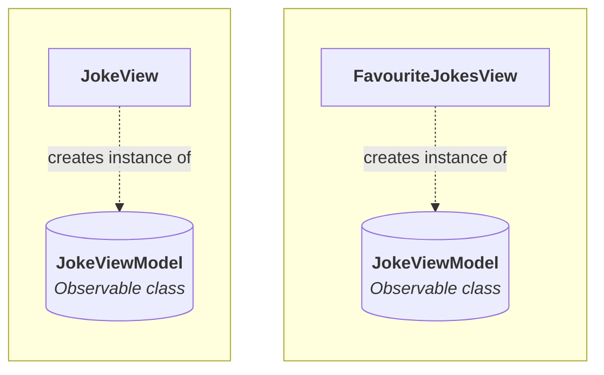
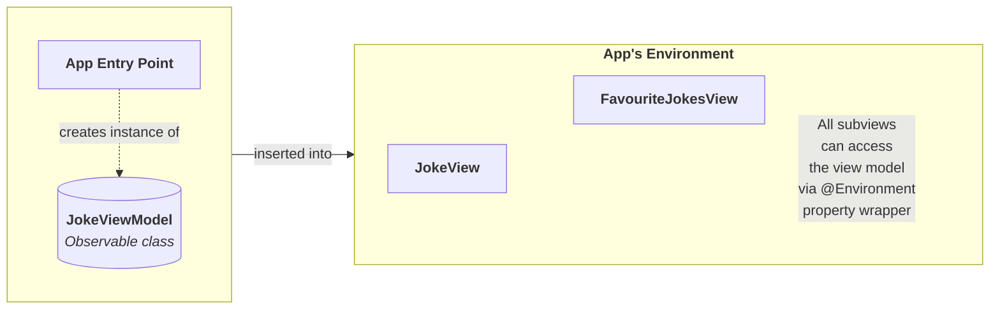

## Introduction

The purpose of this lesson is to build upon what was demonstrated in the [[Retrieving Data from a Remote Endpoint]] lesson, by learning how to:

- [ ] share information between multiple screens within an app
- [ ] add swipe gestures to either discard a joke (swipe left) or save a joke (swipe right)
- [ ] persist (permanently save) information
- [ ] use a share link to send a joke to a friend
- [ ] delete an item from a list

When completed, you will have an app that looks like this:

<div style="padding:56.25% 0 0 0;position:relative;"><iframe src="https://player.vimeo.com/video/1062985316?h=b113472f23&amp;badge=0&amp;autopause=0&amp;player_id=0&amp;app_id=58479" frameborder="0" allow="autoplay; fullscreen; picture-in-picture; clipboard-write; encrypted-media" style="position:absolute;top:0;left:0;width:100%;height:100%;" title="Completed Joke Finder"></iframe></div><script src="https://player.vimeo.com/api/player.js"></script>

Let's begin.

## Saving jokes

This part of the lesson is not very different at all from [[Dynamic Arrays#Add the array|what you did in prior lessons to save an instance of a data type]].

First, in our view model, we need a place to save favourite jokes.

So, take this code:

```swift
// Holds a list of favourite jokes
var favouriteJokes: [Joke] = []
```

... and add it to the stored properties section of the view model, like this:

![[Pasted image 20250305200150.png]]

That code creates a list (array) named `favouriteJokes` that holds instances of the `Joke` data type. The array is empty by default.

Next we need a function within the view model that can be invoked to add the current joke into the array. Copy this code into your clipboard:

```swift
// Add the current joke to the list of favourites
func saveJoke() {
	
	// Save current joke
	if let currentJoke = self.currentJoke {
		favouriteJokes.insert(currentJoke, at: 0)
	}
	
	// How many saved jokes are there now?
	print("There are \(favouriteJokes.count) jokes saved.")

}
```

Then add it to the view model, just below the initializer, like this:

![[Pasted image 20250305200855.png]]

This code inserts the current joke at the start of the array that holds favourite jokes, then, prints a debug statement to the console so that we can see how many elements are in the `favouriteJokes` array. We will try this function out in a moment.

Now we need a way to invoke, or call, this function from the view. For now, we will do this using a button. 

Switch to `JokeView`, and copy this code into your clipboard:

```swift
// Controls whether save button is enabled
@State var jokeHasBeenSaved = false
```

Add that code to the stored properties section of the view, like this:

![[Pasted image 20250305200600.png]]

Now copy this code into your computer's clipboard:

```swift
Button {
	
	// Save the joke
	viewModel.saveJoke()
	
	// Disable this button until next joke is loaded
	jokeHasBeenSaved = true
	
} label: {
	Text("Save for later")
}
.tint(.green)
.buttonStyle(.borderedProminent)
.opacity(buttonOpacity)
.padding(.bottom, 20)
.disabled(jokeHasBeenSaved)
```

... then scroll down to around line 60, and place it just above the existing button, like this:

![[Pasted image 20250305201305.png]]

Now, let's examine what is happening with this code.

> [!DISCUSSION]
> 
> 1. When the button is pressed, the `saveJoke` function we just added to the view model is invoked. Additionally, a boolean value on the view, `jokeHasBeenSaved`, is set to `true` – more on why this was done in a moment.
> 2. We adjust the colour of the button to green so it stands out from the default blue colour of the existing button.
> 3. We piggyback on the work done in the prior lesson – this new button to save a joke will appear and disappear at the same time as the button for loading a new joke.
> 4. Once this button has been pressed, it will be disabled. This is to prevent the same joke from being saved twice. The `.disabled` view modifier allows a button to be "turned off" if a value of `true` is passed to it.

If you try out the code added so far, you should see something like this:

<div style="padding:56.25% 0 0 0;position:relative;"><iframe src="https://player.vimeo.com/video/1063005317?h=698ceac397&amp;badge=0&amp;autopause=0&amp;player_id=0&amp;app_id=58479" frameborder="0" allow="autoplay; fullscreen; picture-in-picture; clipboard-write; encrypted-media" style="position:absolute;top:0;left:0;width:100%;height:100%;" title="Save Joke Button Stays Disabled"></iframe></div><script src="https://player.vimeo.com/api/player.js"></script>

First, the good part – when we press the green **Save for later** button, we see that there is 1 element in the `favouriteJokes` array in the view model.

Now, the bad part – when we choose to load a new joke, the green **Save for later** button remains disabled. We can currently use it only once, which is obviously not ideal.

We can fix this easily. Copy the following code to your clipboard:

```swift                    
// Enable save button again
jokeHasBeenSaved = false
```

Then add it to the block of code that is run when the **New Joke** button is pressed, right after the code that restarts the timers:

![[Pasted image 20250305202456.png]]

Now try your program again – if you save a joke, then load a new joke, you should see that the green button to save a joke is enabled and able to be used again:

<div style="padding:56.25% 0 0 0;position:relative;"><iframe src="https://player.vimeo.com/video/1063006699?h=3e20df88fb&amp;badge=0&amp;autopause=0&amp;player_id=0&amp;app_id=58479" frameborder="0" allow="autoplay; fullscreen; picture-in-picture; clipboard-write; encrypted-media" style="position:absolute;top:0;left:0;width:100%;height:100%;" title="Save Jokes Button Can Be Used Repeatedly"></iframe></div><script src="https://player.vimeo.com/api/player.js"></script>

Let's recap how that works.

First, when the view first loads, the boolean `jokeHasBeenSaved` is set to a default value of `false`:

![[Pasted image 20250305203616.png]]

Second, when we save a joke, that same boolean is set to `true`:

![[Pasted image 20250305203654.png]]

That causes the button to be disabled (greyed out) because we included this view modifier on the button:

![[Pasted image 20250305203732.png]]

Finally, when a new joke is loaded, we reset `jokeHasBeenSaved` back to `false` so that the green button to save a joke can be used to save the next joke, if the user so desires:

![[Pasted image 20250305203821.png]]

Commit and push your work at this point with the following message:

```
Modified view model and view so that a joke can be saved.
```

## Add a tab view

Next we will add a second view, where the user can review favourite jokes.

To allow for movement between the first view (where new jokes are loaded) and the second view (where favourites are seen) we will use a tab view.

First, let's create that second view. Copy this code into your clipboard:

```swift
import SwiftUI

struct FavouriteJokesView: View {
    var body: some View {
        NavigationStack {
            VStack {
                Text("This will show saved jokes.")
            }
            .navigationTitle("Favourites")
        }
    }
}

#Preview {
    FavouriteJokesView()
}
```

Create a new file named `FavouriteJokesView` in the **Views** group in your project, and paste this code into it, like this:

![[Pasted image 20250305204259.png]]

There is nothing new there, so next, please copy this code into your clipboard:

```swift
import SwiftUI

struct LandingView: View {
    
    // MARK: Stored properties
    @State var currentTab = 0
    
    // MARK: Computed properties
    var body: some View {
        TabView(selection: $currentTab) {
            
            JokeView()
                .tabItem {
                    Label {
                        Text("New Jokes")
                    } icon: {
                        Image(systemName: "smiley")
                    }
                    
                }
                .tag(1)
            
            FavouriteJokesView()
                .tabItem {
                    Label {
                        Text("Favourites")
                    } icon: {
                        Image(systemName: "heart.fill")
                    }
                    
                }
                .tag(2)
            
        }
    }
}

#Preview {
    LandingView()
}
```

Create another new view named `LandingView` in the **Views** group, then paste that code into it, like this:

![[Pasted image 20250305204528.png]]

We've learned about tab views before, but not looked at how we can keep track of which tab is selected. Let's examine that more closely...

> [!DISCUSSION]
> 
> 1. We add a stored property to keep track of which tab has been selected by the user. This ensures that when `LandingView` is reloaded, it will "stay" on whatever tab the user last selected. Otherwise, each time `LandingView` is loaded, it would default to the first tab.
> 2. The `tag` view modifiers assign a unique identifier to each tab.
> 3. The `TabView` has a binding to the `currentTab` stored property, so that when a new tab is selected, the stored property is updated.

If you try out your app right now, it should look something like this:

<div style="padding:56.25% 0 0 0;position:relative;"><iframe src="https://player.vimeo.com/video/1063011366?h=ab08a051b0&amp;badge=0&amp;autopause=0&amp;player_id=0&amp;app_id=58479" frameborder="0" allow="autoplay; fullscreen; picture-in-picture; clipboard-write; encrypted-media" style="position:absolute;top:0;left:0;width:100%;height:100%;" title="Inconsistent Navigation Titles"></iframe></div><script src="https://player.vimeo.com/api/player.js"></script>

Do you notice an inconsistency?

There is a navigation title for the view shown by the second tab, but there is no navigation title on the first tab.

To fix this, open `JokeView`, find the `VStack` that is the top-level view inside the `body` property, and use code-folding to hide the details:

![[Pasted image 20250305205623.png]]

Add the following code:

```swift
.navigationTitle("New Jokes")
```

... after the `VStack`, like this:

![[Pasted image 20250305205844.png]]

Then add a few blank lines above the `VStack`, like so:

![[Pasted image 20250305205905.png]]

... and in that space, add a `NavigationStack`:

![[Pasted image 20250305205925.png]]

Finally, move the `VStack` inside the `NavigationStack` – you can highlight the `VStack`, cut it using **Command-X**, and then paste it inside the `NavigationStack` using **Command-V**.

If you fold up the `VStack` again after pasting it in, your code should look like this – notice that in the **Xcode Previews** window at right, we now see the **New Jokes** title showing up:

![[Pasted image 20250305210154.png]]

There is one last step to adding a tab view – remember that the app entry point file:

![[Pasted image 20250305210238.png]]

... determines what view is shown if we run our app within the full iPhone Simulator.

We need to make the following adjustment to the code in the app entry point:

![[Pasted image 20250305210356.png]]

That is, we change the code so that instead of showing `JokeView` when the app is run in the simulator, we load the `LandingView` file, which contains our tab view.

You don't have to test this out yourself (since loading the Simulator can take a long time on some computers) but if you did, you should see the app works like this now – we can switch between tabs within the app:

<div style="padding:56.25% 0 0 0;position:relative;"><iframe src="https://player.vimeo.com/video/1063014207?h=5dde731a3e&amp;badge=0&amp;autopause=0&amp;player_id=0&amp;app_id=58479" frameborder="0" allow="autoplay; fullscreen; picture-in-picture; clipboard-write; encrypted-media" style="position:absolute;top:0;left:0;width:100%;height:100%;" title="Tab View Operational"></iframe></div><script src="https://player.vimeo.com/api/player.js"></script>

We've made some nice progress here, so let's [[Pushing Commits|commit and push]] our work with this message:

```
Added a tab view to switch between getting new jokes and reviewing favourites.
```

## Sharing data

Right now, an instance of the `JokeViewModel`, the view model, is created within `JokeView`:

![[Pasted image 20250306060509.png]]

This means the view model is within the *scope* of `JokeView` alone. It can only be accessed from within `JokeView`:

![[Pasted image 20250306060523.png]]

However, we need to access the information held within the view model on a second view – `FavouriteJokesView` – which is intended to show the list of saved jokes:

![[Pasted image 20250306060541.png]]

How can we make this happen?

There are multiple approaches to doing this – we will learn about one of them today.

### Single source of truth

One idea that might occur to you – and is perhaps reasonable at first glance – why not just create a second instance of `JokeViewModel` inside `FavouriteJokesView`, like this?

![[Screenshot 2025-03-06 at 6.11.57 AM.png]]

Please, don't do this!

The problem with this approach – creating an instance of `JokeViewModel` inside each view that needs to access the view model – is that these are *different instances*. Like this:




In this scenario, nothing is shared between the two different instances of `JokeViewModel`.

That scenario breaks the *cardinal rule* of app development with SwiftUI:

> Use a single source of truth.

Using a single source of truth means that data must be created and held in *one* location.

Data can be *shared* between views but there should never be two or more copies of the same data.

This relates back to the cardinal rule of this course!

Remember?

> **D**on't **R**epeat **Y**ourself

If it's still not clear to you why we can't just create two instances of the view model, think a bit more about what the view model does.

`JokeViewModel` retrieves a joke from a remote endpoint – a website on the Internet.

If we create an instance of the view model within each view that needs it – *separate* instances will retrieve *different* jokes.

The view model also holds our array, or list, of favourite jokes.

If we use a second instance of the view model within `FavouriteJokesView`, it will be a different array than the instance of the view model created within `JokeView`.

So, we need to *share* data. How can we do that?

### Use the environment

One way to share data between views in SwiftUI is to use the environment:

![[Pasted image 20250306062807.png|400]]

With more detail, here is what that looks like as a concept:

![[Root View 1.png]]

Here is what that will look like within the app we are writing today:



Let's get started on this.

First, navigate to `JokeView` and locate where the view model is currently created:

![[Pasted image 20250306062950.png]]

Delete that code, like this:

![[Pasted image 20250306063008.png]]

Some errors will be created. Don't worry – this is temporary.

Next, navigate to the app entry point file:

![[Pasted image 20250306063038.png]]

Copy this code into your clipboard:

```swift
import SwiftUI

@main
struct JokeFinderLessonApp: App {
    
    // MARK: Stored properties

    // Create the view model
    @State var viewModel = JokeViewModel()
    
    // MARK: Computed properties
    var body: some Scene {
        WindowGroup {
            JokeView()
                .environment(viewModel)
        }
    }
    
}
```

... and replace the code in the app entry point file, like this:

![[Pasted image 20250306063427.png]]

Let's examine that code.

> [!DISCUSSION]
> 
> 1. An instance of the view model is now created as a stored property right within the app entry point.
> 2. We *insert* this instance into the environment using the `.environment` view modifier, attached to `LandingView`. The view model instance can now be shared with other views, through the environment.

Next, we need at "reach into" the environment and access the view model from other views.

Navigate back to `JokeView`:

![[Pasted image 20250306063833.png]]

Copy this code into your clipboard:

```swift
// Access the view model from the environment
@Environment(JokeViewModel.self) var viewModel
```

... and paste it into `JokeView`:

![[Pasted image 20250306063926.png]]

Your app will almost immediately crash! Don't worry. We will fix this soon.

We need to access the view model from `FavouriteJokesView` as well.

So, please take this code:

```swift
// MARK: Stored properties

// Access the view model from the environment
@Environment(JokeViewModel.self) var viewModel

// MARK: Computed properties
```

... and add it to `FavouriteJokesView`, like this:

![[Pasted image 20250306064152.png]]

Now the two views that need to access the view model through the environment are "reaching into" the environment to do just that. Recall the theory of what we are doing:


However, there is the small matter of our app crashing. Why is this happening?

Well, remember that when using Xcode, there are [[Running Your Code|two ways to run an app's code]]:

1. We can run our app on a physical device or in the **Simulator**; in this case, the app entry point code is run. 
2. We can *preview* each individual view within the **Previews** window at right.

It's because of the second way that our code is run that our Jokes app is currently crashing.

`JokeView` and `FavouriteJokesView` both, now, reach into the environment in an attempt to get a reference to the shared instance of the view model.

The problem with the **Previews** window is that within the preview of each view, on their own... there *is no instance* of the view model to get a reference to.

To see a preview of each view on their own, we need to make a temporary, individual instance of the view model, just for the purpose of using the **Preview** window, like this – please add this code as shown on line 30 in `FavouriteJokesView`:

![[Pasted image 20250306065523.png]]

And like this – please add this code to `JokeView`, around line 130:

![[Pasted image 20250306065615.png]]

And finally, since `LandingView` in turn creates instances of `JokeView` and `FavouriteJokesView`, we need to add code to `LandingView` as well, like this, around line 47:

![[Pasted image 20250306071522.png]]

You should now be able to re-start the **Previews** window on any of these three views, using the **Option-Command-P** keyboard shortcut, and see each view working as before.

However, at this point, you might be getting a little frustrated with Mr. Gordon:

> "Didn't he just tell me that there should only be a *single source of truth* and that we should only create *one* instance of the view model and *share* it between views?"

Well, yes, he did – and that's true – we must only have a single source of truth – one instance of the view model – to be shared among views when *running on a device* or *in the Simulator*.

We must also have a *single source of truth* when using the **Previews** window – and – we do! Remember, the **Previews** window lets us examine each view, one at a time, *completely independent of any other views in our app*.

When we *preview* `LandingView`, it has just one instance of the view model:

![[Pasted image 20250306070308.png]]

When we *preview* `JokeView`, it has just one instance of the view model:

![[Pasted image 20250306070548.png]]

Finally, when we *preview* `FavouriteJokesView`, it has just one instance of the view model:

![[Pasted image 20250306070859.png]]

> [!IMPORTANT]
> 
> Running an app on a device, or in the Simulator, is done within a totally different space than when using the **Previews**.
> 
> Each view that is seen from the **Previews** interface runs separately from any other view.
> 
> Even though we now have code that creates an instance of `JokeViewModel` in *four* places within our app's *source code*... we are not breaking the *single source of truth* rule when our app's *code is run*... because our code is running within four spaces that are completely independent from one another.

*Phew*. 😮‍💨

OK, with that important conceptual understanding out of the way, now, we can actually use the view model's data from multiple views within our app.

Navigate back to `FavouriteJokesView` and find this line of code, which was a placeholder we created earlier – it may be around line 21:

![[Pasted image 20250306072039.png]]

Copy this code into your clipboard:

```swift
// When there are no saved jokes...
if viewModel.favouriteJokes.isEmpty {
	
	// ... show an appropriate message
	ContentUnavailableView(
		"No favourite jokes",
		systemImage: "heart.slash",
		description: Text("See if a new joke might tickle your funny bone!")
	)
	
} else {
	
	// ...otherwise, show how many jokes have been saved
	Text("There are \(viewModel.favouriteJokes.count) saved jokes.")
	
}
```

... and replace the existing placeholder code, like this:

![[Pasted image 20250306072654.png]]

Now to test this code out, navigate to `LandingView`, and try out the app – you should find that jokes we save on the **New Jokes** screen are now accessible on the **Favourites** screen within the app:

<div style="padding:56.25% 0 0 0;position:relative;"><iframe src="https://player.vimeo.com/video/1063157811?h=814ea45db3&amp;badge=0&amp;autopause=0&amp;player_id=0&amp;app_id=58479" frameborder="0" allow="autoplay; fullscreen; picture-in-picture; clipboard-write; encrypted-media" style="position:absolute;top:0;left:0;width:100%;height:100%;" title="Sharing Data Between Screens"></iframe></div><script src="https://player.vimeo.com/api/player.js"></script>

At this point, be sure to [[Pushing Commits|commit and push]] your work with the following message:

```
Now sharing view model through the environment so that we can access saved jokes on another screen.
```

## Showing jokes in a list

Now that we can access the view model on `FavouriteJokesView`, it is trivial to actually show the list of saved jokes.

Copy this code into your clipboard:

```swift
// Show a scrollable list of saved jokes
List(viewModel.favouriteJokes) { currentJoke in
	VStack(alignment: .leading, spacing: 5) {
		Text(currentJoke.setup ?? "")
		Text(currentJoke.punchline ?? "")
			.italic()
	}
}
.listStyle(.plain)
```

Navigate to `FavouriteJokesView` and find the code that displays how many jokes have been saved:

![[Pasted image 20250306080555.png]]

Replace that code with the code from your clipboard, like this:

![[Pasted image 20250306080653.png]]

Let's examine that code.

> [!DISCUSSION]
> 
> 1. We iterate over the array `favouriteJokes` from the view model.
> 2. Each element of that array is made available, one by one, using the `currentJoke` reference.
> 3. We use the `currentJoke` reference to show the setup and then the punchline. We italicize the punchline so it stands out a bit from the joke's setup. Finally, we make use of the [nil coalescing operator](https://www.hackingwithswift.com/example-code/language/what-is-the-nil-coalescing-operator) to provide a default value of an empty string, since `setup` and `punchline` both have a data type of optional `String`, from our `Joke` model structure.

If you try out the app again, you should be able to review your list of saved jokes:

<div style="padding:56.25% 0 0 0;position:relative;"><iframe src="https://player.vimeo.com/video/1063171078?h=9df408a8ff&amp;badge=0&amp;autopause=0&amp;player_id=0&amp;app_id=58479" frameborder="0" allow="autoplay; fullscreen; picture-in-picture; clipboard-write; encrypted-media" style="position:absolute;top:0;left:0;width:100%;height:100%;" title="Scrollable List of Saved Jokes"></iframe></div><script src="https://player.vimeo.com/api/player.js"></script>

Please now [[Pushing Commits|commit and push]] your work with this message:

```
Now showing favourite jokes in a scrollable list.
```

## Custom colors

Our app is coming together, but it's looking rather plain.

We can fix this by making judicious use of color.

Let's create a custom color, then use that as the background layer for `FavouriteJokesView`.

Here is a video showing how to create the custom color – it's a bit hard to describe this in writing – please make your own custom color after watching this brief video:

<div style="padding:56.25% 0 0 0;position:relative;"><iframe src="https://player.vimeo.com/video/1063173891?h=9eec0edfa1&amp;badge=0&amp;autopause=0&amp;player_id=0&amp;app_id=58479" frameborder="0" allow="autoplay; fullscreen; picture-in-picture; clipboard-write; encrypted-media" style="position:absolute;top:0;left:0;width:100%;height:100%;" title="Creating a Custom Color"></iframe></div><script src="https://player.vimeo.com/api/player.js"></script>

In order in that video, we:

- [ ] create a new custom color named `ForFavouriteJokes`
- [ ] we open the Attributes inspector, and then the Color panel
- [ ] we create a new color for light mode / light appearance
- [ ] we copy the existing color to the dark mode / dark appearance color well
	- [ ] we reduce the brightness of the color a bit, so it is appropriate for use in dark mode

Next, navigate back to the `FavouriteJokesView` code:

![[Pasted image 20250306082544.png]]

Fold up the `VStack`:

![[Pasted image 20250306082619.png]]

Add an empty `ZStack` above the `VStack`:

![[Pasted image 20250306082646.png]]

Cut and then paste the `VStack` so it is inside the `ZStack` – if you fold up the `VStack` afterwards, it will look like this:

![[Pasted image 20250306082732.png]]

Then, add the following code:

```swift
// Background layer
Color.forFavouriteJokes
	.ignoresSafeArea()

// Foreground layer
```

... above the `VStack`, but inside the `ZStack`:

![[Pasted image 20250306082910.png]]

Since `Color` structures are "greedy" or push-out views, and since we added the `ignoresSafeArea` view modifier, the background layer of the `ZStack` pushes out to the edges of the phone's screen.

The foreground layer is the `VStack` which contains the earlier code that we wrote.

[[Pushing Commits|Commit and push]] your work now with this message:

```
Created a custom color to use with the favourite jokes view.
```

## Deleting jokes

After saving a joke, we may find later on that when we try it out on friends, it's not landing well:

![[Pasted image 20250306083238.png]]

As such, we may want to delete a saved joke from our list of favourites.

To do this, we need to make one adjustment to our view model – remember, the view model's job is to handle all tasks related to the *state* of data within our app. Since we are deleting data, the logic to do that should go into the view model.

Then, we need to invoke the new code that we add to the view model from the view – so that the user can actually delete a saved joke.

First, navigate to `JokeViewModel`:

![[Pasted image 20250306083447.png]]

With code folded up, it's pretty simple right now.

There are stored properties to hold the current joke and the list of favourite jokes.

There is an initializer that fetches a new joke when the view model is created.

Finally, there are functions to save a joke, and to fetch another joke from the endpoint.

Copy this code into your clipboard:

```swift
// Delete a joke from the list of favourites
func delete(_ jokeToDelete: Joke) {
	
	// Remove the provided joke from the list of saved favourites
	favouriteJokes.removeAll { currentJoke in
		currentJoke.id == jokeToDelete.id
	}
	
	// How many saved jokes are there now?
	print("There are \(favouriteJokes.count) jokes saved.")

}
```

... and add it below the function that saves a joke, like this:

![[Pasted image 20250306083720.png]]

Let's examine that code.

> [!DISCUSSION]
> 
> 1. The function is named `delete` and it needs one piece of information – what joke is meant to be deleted. The function receives that information in the `jokeToDelete` argument.
> 2. Arrays in Swift come with a built-in function named `removeAll`. This function accepts a closure – a block of code – that must provide a condition that will evaluate to `true` to indicate what element(s) should be removed from the array.
> 3. `removeAll` iterates over the elements of the array, and as it does so, we place each element of the array, temporarily, in a reference named `currentJoke`.
> 4. As we iterate over the array's elements, we compare each joke's unique identifier to the unique identifier of the joke we want to delete. When these match, the condition in the block of code evaluates to `true` and the matching element is removed from the array.

Now that we have code in the view model to delete a joke, we need a way to invoke, or call it, from the view.

Navigate to `FavouriteJokesView` and find the `VStack` inside the `List` structure:

![[Pasted image 20250306084403.png]]

Copy this code into your clipboard:

```swift
.swipeActions {
	
	// Delete
	Button("Delete", role: .destructive) {
		withAnimation {
			viewModel.delete(currentJoke)
		}
	}
	
}
```

... then attach it to the `VStack`, like this:

![[Pasted image 20250306084517.png]]

Let's review that code.

> [!DISCUSSION]
> 
> 1. The `.swipeActions` view modifier makes it possible to swipe on a list item to take an action of some kind. You will see this demonstrated in a video in a moment.
> 2. We add a `Button` inside the `.swipeActions` view modifier.
> 3. This button is labeled `Delete` and by providing the `role` parameter with an argument of `.destructive` SwiftUI will know to make the button red – this is a standard way for iOS apps to communicate that taking an action will result in data being removed.
> 4. The block of code run when the button is pressed invokes the `delete` function that we just added to the view model. We pass in the `currentJoke` to indicate that when it is swiped, it is the one that should be deleted. By wrapping this action in `withAnimation` SwiftUI will animate the change in state when an item is removed from the list.

Try out the app. You should see that it works like this now:

<div style="padding:56.25% 0 0 0;position:relative;"><iframe src="https://player.vimeo.com/video/1063183596?h=6e0f84d0d4&amp;badge=0&amp;autopause=0&amp;player_id=0&amp;app_id=58479" frameborder="0" allow="autoplay; fullscreen; picture-in-picture; clipboard-write; encrypted-media" style="position:absolute;top:0;left:0;width:100%;height:100%;" title="Deleting Items From a List"></iframe></div><script src="https://player.vimeo.com/api/player.js"></script>

Please commit and push your changes with this message:

```
Can now delete saved jokes.
```

## Add an app icon

We're getting close to having a complete app. As you create apps that you find useful, it's nice to add a bit of polish.

Let's take a break from writing code, and make an app icon!

[Download and install Bakery](https://apps.apple.com/ca/app/bakery-simple-icon-creator/id1575220747?mt=12) to your computer. This is an app written by Jordi Bruin, who started out as a graphic designer, and then got into writing apps that solve simple problems for others. If he sounds familiar, that's because he also wrote [Cibo](https://apps.apple.com/us/app/cibo-visual-menu-translator/id1583992402), the visual menu translation app that we discussed at the start of the school year!

Here is a video showing how you can create an app icon. You'll need to use drag and drop to get the icon into Xcode, so be sure you are not running it in full screen mode.

Have a look, then try doing the same steps:

<div style="padding:56.25% 0 0 0;position:relative;"><iframe src="https://player.vimeo.com/video/1063187336?h=9efaadd14b&amp;badge=0&amp;autopause=0&amp;player_id=0&amp;app_id=58479" frameborder="0" allow="autoplay; fullscreen; picture-in-picture; clipboard-write; encrypted-media" style="position:absolute;top:0;left:0;width:100%;height:100%;" title="Creating an App Icon"></iframe></div><script src="https://player.vimeo.com/api/player.js"></script>

Notice how Bakery takes care of making app icons in all the various required sizes and formats to be used with different Apple devices. This is a *huge* time saver!

To see the app icon, you'll need to run your app [[Running Your Code#Running an app in the Simulator|either in the full Simulator]], or [[Deploy to a Device|on a device]].

Please now [[Pushing Commits|commit and push your work]] with this message:

```
Added an app icon.
```

## Sharing a joke

Next we'll make it possible to share a joke with a friend. This is done using [the `ShareLink` structure](https://www.hackingwithswift.com/books/ios-swiftui/how-to-let-the-user-share-content-with-sharelink) provided by Apple as part of SwiftUI.

There are multiple ways to use `ShareLink` but we will use it to share the text of a joke.

First, to make the share sheet show a nice icon, we need an image to show within the share sheet.

We can use one of the images from our app icon. 

Please watch this video to see how this is done:

<div style="padding:56.25% 0 0 0;position:relative;"><iframe src="https://player.vimeo.com/video/1063189498?h=2bc08754bd&amp;badge=0&amp;autopause=0&amp;player_id=0&amp;app_id=58479" frameborder="0" allow="autoplay; fullscreen; picture-in-picture; clipboard-write; encrypted-media" style="position:absolute;top:0;left:0;width:100%;height:100%;" title="Creating an Image to Share a Joke"></iframe></div><script src="https://player.vimeo.com/api/player.js"></script>

Next we will make a small addition to the model for a given joke – navigate to the `Joke` structure:

![[Pasted image 20250306091404.png]]

Copy this code into your clipboard:

```swift
// MARK: Computed properties
    
// Return setup and punchline (for sharing via text message)
var setupAndPunchline: String {
	
	if let setup = self.setup, let punchline = self.punchline {
		return "\(setup)\n\n\(punchline)"
	} else {
		return ""
	}
	
}
```

... and add it to the `Joke` structure like this:

![[Pasted image 20250306091451.png]]

The new computed property named `setupAndPunchline` combine the existing stored properties named `setup` and `punchline` into a single string, which we will use with the share link in a moment.

Navigate to `FavouriteJokesView` and find the `.swipeActions` view modifier:

![[Pasted image 20250306091624.png]]

Copy this code into your clipboard:

```swift
// Share
ShareLink(
	"Share",
	item: currentJoke.setupAndPunchline,
	preview: SharePreview(
		"Share Joke",
		image: Image("ShareJokeImage")
	)
)
```

Now, after the first button (that allows jokes to be deleted), add that code:

![[Pasted image 20250306091734.png]]

That `ShareLink` code uses the computed property we just added, along with the `ShareJokeImage` asset that we added a moment ago.

To really test this code out, you need to [[Deploy to a Device|run it on a device]]. When you swipe on a saved joke, you will be able to press the "share arrow" icon and send a joke to a friend using a text message.

Please now commit and push your work with this message:

```
Made it possible to share a saved joke.
```

## Persisting jokes

Finally, this app is, overall, not super useful unless jokes we save are still there the next time we open the app.

This is called *persisting* data, or data persistence.

There are many ways to persist data – one way is to use a database, which we are starting to learn about.

Another way, when the data that needs to be persisted is pretty simple, is to simply write the information to a plain text file formatted as JSON.

That is what we will do for this app. Whenever a joke is either saved or deleted from our list of favourites, we will write a JSON file to the internal storage of the phone. When the app opens, we read from this same file.

To do this, first create a new group named **Shared** in your project, like this:

![[Pasted image 20250306092453.png]]

Then create a new empty file named `SharedFunctionsAndConstants`, like this:

![[Pasted image 20250306092529.png]]

Now copy this code into that new file:

```swift
import Foundation

// Return the directory that we can save user data in
func getDocumentsDirectory() -> URL {
    let paths = FileManager.default.urls(for: .documentDirectory, in: .userDomainMask)
    return paths[0]
}

// Identify the file that data will be saved to in Documents directory
let fileLabel = "FavouriteJokes"
```

This is some helper code that uses Apple frameworks to find the folder that we can save our data to.

It also creates a constant with the name of the file we will save our data to.

Next, to save a bit of time with editing, please simply copy and paste all of this code into your clipboard:

```swift
import Foundation

@Observable
class JokeViewModel {
    
    // MARK: Stored properties
    
    // Whatever joke has most recently been downloaded
    // from the endpoint
    var currentJoke: Joke?
    
    // Holds a list of favourite jokes
    var favouriteJokes: [Joke] = []
    
    // MARK: Initializer(s)
    init(currentJoke: Joke? = nil) {
        
        // Take whatever joke was provided when an instance of
        // this view model is created, and make it the current joke.
        //
        // Otherwise, the default value for the current joke
        // will be a nil.
        self.currentJoke = currentJoke

        // Load a joke from the endpoint
        Task {
            await self.fetchJoke()
        }
        
        // Get saved jokes from device storage
        loadFavouriteJokes()

    }
    
    // Add the current joke to the list of favourites
    func saveJoke() {
        
        // Save current joke
        if let currentJoke = self.currentJoke {
            favouriteJokes.insert(currentJoke, at: 0)
        }
        
        // How many saved jokes are there now?
        print("There are \(favouriteJokes.count) jokes saved.")
        
        // Write the updated list of jokes to the JSON file stored on device
        self.persistFavouriteJokes()

    }
    
    // Delete a joke from the list of favourites
    func delete(_ jokeToDelete: Joke) {
        
        // Remove the provided joke from the list of saved favourites
        favouriteJokes.removeAll { currentJoke in
            currentJoke.id == jokeToDelete.id
        }
        
        // How many saved jokes are there now?
        print("There are \(favouriteJokes.count) jokes saved.")
        
        // Write the updated list of jokes to the JSON file stored on device
        self.persistFavouriteJokes()

    }
    
    // MARK: Function(s)
    
    // This loads a new joke from the endpoint
    //
    // "async" means it is an asynchronous function.
    //
    // That means it can be run alongside other functionality
    // in our app. Since this function might take a while to complete
    // this ensures that other parts of our app, such as the user
    // interface, won't "freeze up" while this function does it's job.
    func fetchJoke() async {
        
        // 1. Attempt to create a URL from the address provided
        let endpoint = "https://official-joke-api.appspot.com/random_joke"
        guard let url = URL(string: endpoint) else {
            print("Invalid address for JSON endpoint.")
            return
        }
        
        // 2. Fetch the raw data from the URL
        //
        // Network requests can potentially fail (throw errors) so
        // we complete them within a do-catch block to report errors
        // if they occur.
        //
        do {
            
            // Fetch the data
            let (data, _) = try await URLSession.shared.data(from: url)

            // Print the received data in the debug console
            print("Got data from endpoint, contents of response are:")
            print(String(data: data, encoding: .utf8)!)
            
            // 3. Decode the data into a Swift data type
            
            // Create a decoder object to do most of the work for us
            let decoder = JSONDecoder()
            
            // Use the decoder object to convert the raw data
            // into an instance of our Swift data type
            let decodedData = try decoder.decode(Joke.self, from: data)
            
            // If we got here, decoding succeeded,
            // return the instance of our data type
            self.currentJoke = decodedData
            
        } catch {
            
            // Show an error that we wrote and understand
            print("Count not retrieve data from endpoint, or could not decode into an instance of a Swift data type.")
            print("----")
            
            // Show the detailed error to help with debugging
            print(error)
            
        }
    }
    
    // Load saved jokes from file on device
    func loadFavouriteJokes() {
        
        // Get a URL that points to the saved JSON data containing our list of favourite jokes
        let filename = getDocumentsDirectory().appendingPathComponent(fileLabel)
        
        print("Filename we are reading persisted jokes from is:")
        print(filename)
        
        // Attempt to load from the JSON in the stored file
        do {
            
            // Load the raw data
            let data = try Data(contentsOf: filename)
            
            print("Got data from file, contents are:")
            print(String(data: data, encoding: .utf8)!)
            
            // Decode the data into Swift native data structures
            self.favouriteJokes = try JSONDecoder().decode([Joke].self, from: data)
            
        } catch {
            
            print(error)
            print("Could not load data from file, initializing with empty list.")
            
            self.favouriteJokes = []
        }
        
    }
    
    // Write favourite jokes to file on device
    func persistFavouriteJokes() {
        
        // Get a URL that points to the saved JSON data containing our list of people
        let filename = getDocumentsDirectory().appendingPathComponent(fileLabel)
        
        print("Filename we are writing persisted jokes to is is:")
        print(filename)
        
        do {
            
            // Create an encoder
            let encoder = JSONEncoder()
            encoder.outputFormatting = .prettyPrinted
            
            // Encode the list of people we've tracked
            let data = try encoder.encode(self.favouriteJokes)
            
            // Actually write the JSON file to the documents directory
            try data.write(to: filename, options: [.atomicWrite, .completeFileProtection])
            
            print("Wrote data to file, contents are:")
            print(String(data: data, encoding: .utf8)!)
            
            print("Saved data to documents directory successfully.")
            
        } catch {
            
            print(error)
            print("Unable to write list of favourite jokes to documents directory.")
        }
        
    }
}

```

Replace all of the code in your `JokeViewModel` file with the new code, like this:

![[Pasted image 20250306093116.png]]

You will notice that not many lines of code actually changed. Take a close look at what did change, and read the comments to understand how the code works.

Then, run your app in the **Simulator** or on a device. Watch the debug output in Xcode to see what is happening as you use the app.

Please commit and push your work with this message:

```
Saved jokes are now persisted to a JSON file kept on device.
```

## Swipe left or right

> [!NOTE]
> 
> Coming soon. As this lesson was getting a tad long, Mr. Gordon decided that adding swipe left and swipe right gestures deserves its own lesson!